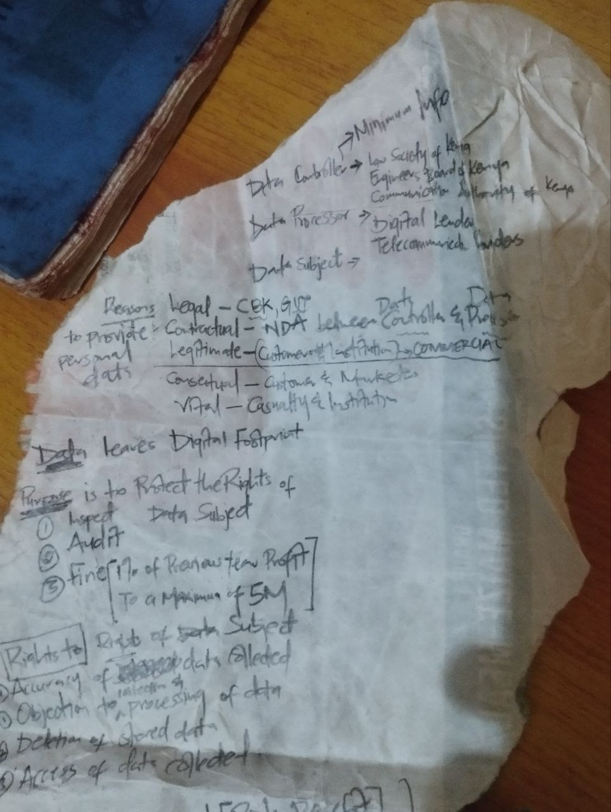
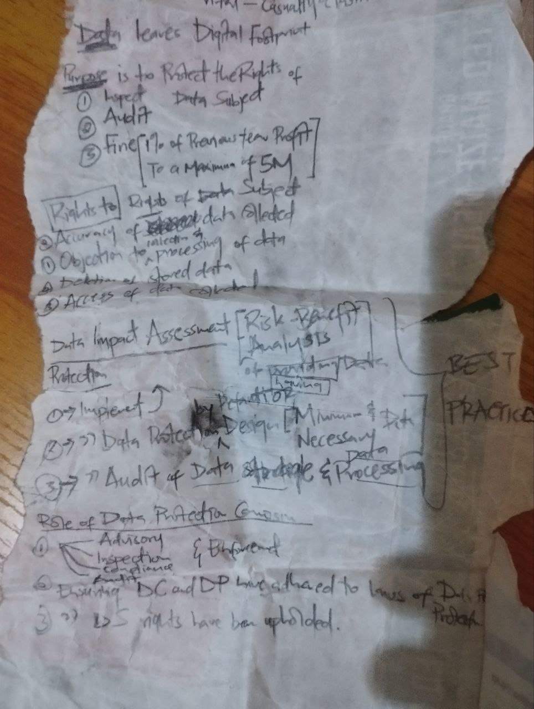
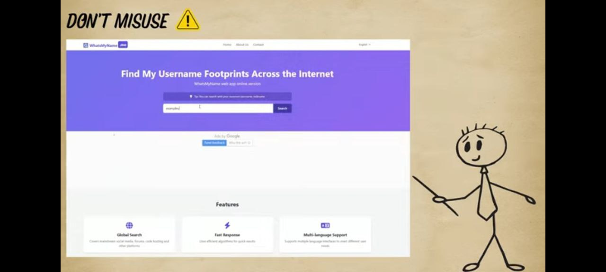
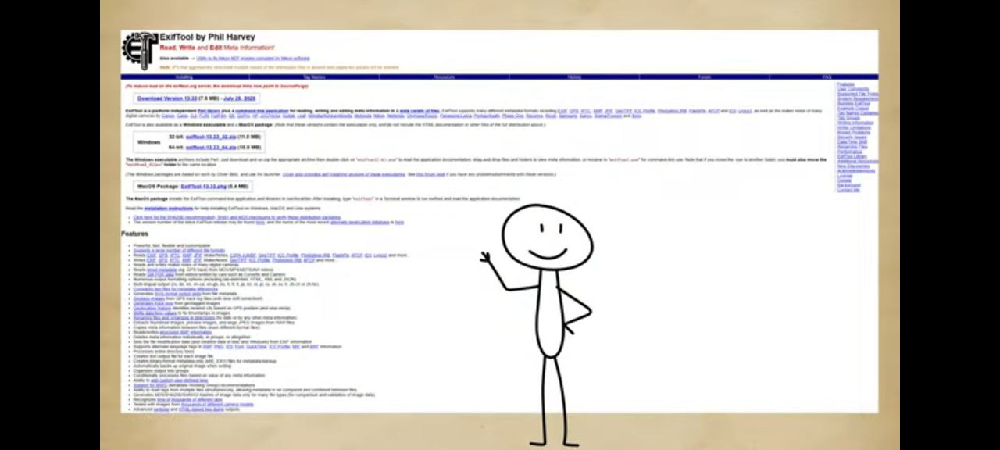
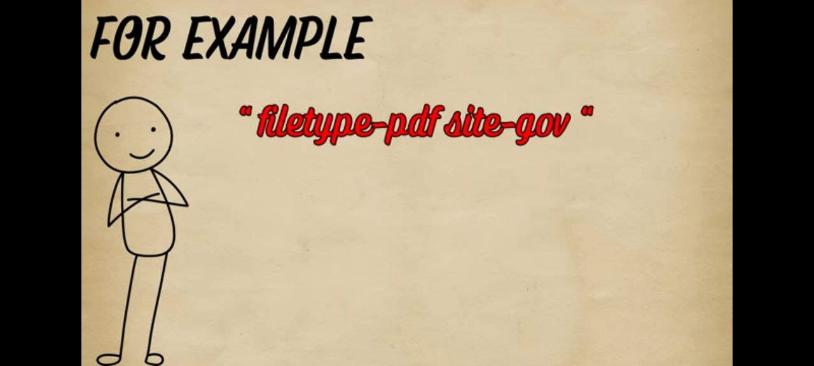
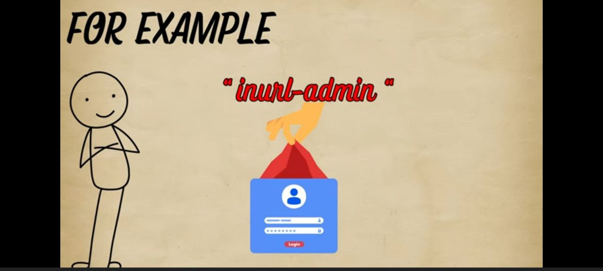
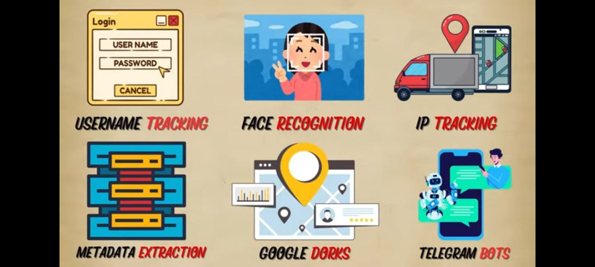

[Cloud Security Research Qualys Community](https://community.qualys.com/)
## 1. Data Security
## 2. Data Protection
## 3. Data Privacy Rights

# DATA PROTECTION

```
- Legal sphere
- Technical sphere
- Organisational sphere
```
# LEGAL SPHERE

```
* Within 72 HRS Complaint to be issued to the commissioner 
* Within 90 DAYS / 3 MONTHS Completion of Audit/Investigations.
* General Data Protection Regulation Laws EU based Reliance on Best Practices.

🚀 *** PURPOSE ***
1. Provide advisory services on Data Protection Laws/Regulations on areas pertaining data storage, data processing and data transmission.
2. -> Guarantee data subjects(individuals) their rights to data privacy.

3. Inspect Data Controllers and Data Processors to ensure compliance to Data Protection Laws/Regulations. 
4. Regulate Data Controllers and Data Processors to ensure compliance to Data Protection Laws/Regulations.

5. Audit data storage, data processing and data transmission.
6. Enforce Data Protection Laws/Regulations.
----------------------------------------------------------------------------------------------------------------------------------------------------------------------------------------------------------------------------
7. -> Encourage/Foster innovation in emerging trends in technology by providing data protection(cryptography[data encryption and decryption mechanisms], digital forensics)guidelines on data storage, data processing and data transmission.
----------------------------------------------------------------------------------------------------------------------------------------------------------------------------------------------------------------------------
```

# 🚀 7. DATA PROTECTION PRIVACY STATEMENT.ZIP

## 🚀 PURPOSE
### The ODPC’s statutory powers, functions and duties derive from the data protection legislation set out above, and include the following:

(a)   oversee the implementation of and be responsible for the enforcement of this Act;

(b)  Establish and maintain a register of data controllers and data processors;

(c)   Exercise oversight on data processing operations, either of its own motion or at the request of a data subject, and verify whether the processing of data is done in accordance with the Act;

(d)  Promote self-regulation among data controllers and data processors;

(e)   Conduct an assessment, on its own initiative, of a public or private body, or at the request of a private or public body for the purpose of ascertaining whether information is processed according to the provisions of the Act or any other relevant law;

(f)   Receive and investigate any complaint by any person on infringement of the right of the Act

(g)  Take such measures as may be necessary to bring the provisions of the Act to the knowledge of the general public;

(h)  Carry our inspections of public and private entities with a view to evaluating the processing of personal data;

(i)    Promote international cooperation in matters relating to data protection and ensure Country’s compliance on data protection obligations under international conventions and agreements; and

(j)    Undertake research on developments in data processing of personal data an ensure that there are no significant risk or adverse effect of any developments on the privacy of individuals.

### Purposes for which the ODPC may collect personal data in accordance with its functions are:

    1. Queries and concerns.
    ------------------------------------------------------------------------------------------------------------
    2. Service providers and suppliers.
    3. Conferences, events and stakeholder forums.
    ------------------------------------------------------------------------------------------------------------
    4. Breach notifications.
    5. Complaint handling.
    6. Inquiries and investigations.
    
### Disclosure to third parties

    1. For the purpose of legal proceedings.
    2. In the case of service providers or suppliers to the ODPC.
    ------------------------------------------------------------------------------------------------------------
    3. In the case of cross border processing or for the purpose of co-operation with other supervisory authorities.
    4. Where the sharing of the personal data is necessary for the performance by the ODPC of its functions  -- to ensure procedural fairness.
    
### Your Data Protection Rights

Under data protection law, data subjects have certain rights. The data subject rights are:

    1. The right to be informed about the processing of your personal data;
    2. The right to access your personal data;
    3. The right to rectification of your personal data;
    4. The right to erasure of your personal data;
    5. The right to data portability;
    6. The right to object to processing of your personal data; and
    7. The right to restrict processing of your personal data.

 



# TECHNICAL SPHERE

## Information Security Objectives

The general objective of this proposal is to create a standard set of high-level information security rules for all institutions, bodies, offices and agencies of the Union to ensure an enhanced and consistent degree of protection against the evolving threats to their information.

The general objective is translated into four specific objectives:

 - Establish harmonised and comprehensive categories of information based on the level of confidentiality;
 - Identify security gaps and implement measures required;
 - Establish an efficient forum for cooperation on information security between the institutions, bodies, offices and agencies of the Union;
 - Modernise the information security policies, taking account of current trends such as digital transformation and remote working.

```   
-----------------------------------------------------------------------------------------------------------
*** SCRUM STUDY AGILE MANAGEMENT BODY ***
dancunmoruri@gmail.com 
ALPHA&&OMEGA
ID: 1601686
-----------------------------------------------------------------------------------------------------------

*** 1. CRYPTOGRAPHY (Data)
    🚀 CONFIDENTIALITY
- RSA Algorithm 
- AES Algorithm
- Grovers Algorithm
*** 2. DATA FOOTPRINT (data storage, data processing and data transmission)
    🚀 AVAILABILITY (COOKIE/CACHE SESSION)
- BLOCKCHAIN Explorer ---> Cryptocurrency
   -> Blockchain.com
   -> Etherscan
   -> Getblock
   -> BlockCypher
   -> Blockchair
*** 3. AUDIT/INVESTIGATE (data storage, data processing and data transmission)
    🚀 INTEGRITY
- SIEM (Security Information Event Management System) / UEBA (User Enterprise Behaviour Analysis)
- Digital Forensics Tools(Blue Team Tools GENERAL on Github) + Algorithms
    -> Digital Signatures
    -> Message Authentication Codes
    -> SIGs - (Special Interest Groups)Forensic Genealogy Special Interest Group provides education, collaboration, networking, and support for those engaged in forensic science and forensic genealogy business pursuits.
```

# ORGANIZATIONAL SPHERE

```
- Organizational sphere 🚀 WHY -> 🚀 DISTRIBUTED BACKUPS READY FOR ANY NEGATIVE INEVENTUALITY/OUTCOME/AFTERMATH
                        🚀 HOW -> IDENTIFY -> PROTECT -> DETECT -> RESPOND -> RECOVER
                        🚀 WHAT -> CIA Triad - (Confidentiality, Integrity, Availability)
                        -> SOC - (Security Operation Centre)
                           *Prevention, Detection, Response*
                        -> XDR - (Extended Detection Response)
                        -> SOAR - (Security Orchestration Automation Response system)
                           SOAR = SOC + XDR

1*GOVERNANCE - POLICY/LAW
2*CRYPTOGRAPHY         ===> 2FA, USB Authentication, Cookie/Cache Session Authentication
3*NETWORK SECURITY     ===> Firewall, VPN, Endpoints Configurations, Proxy and Reverse Proxy(Orchestration+Load Balancer)[Nginx, Apache2]
4*[AUTHENTICTATION, IDENTITY and ACCESS MANAGEMENT] SECURITY ===> Controls for Admin + Manager + User Accounts
-----------------------------------------------
Active Directory(Using LDAP Protocol)
- USB Signing
- MFA(Face, Fingerprint)
- 2FA
- Passwordless
- SSO(Single Sign On)

PAY ATTENTION TO: Location, Request Type & Amount, Frequency
Types of Administrators
Root
System
Database
Network
All these Administrators must sign in to a PAM(Privileged Access Management)System 
-----------------------------------------------

5*APPLICATION SECURITY ====> Penetration Vulnerability Testing/DEVSECOPS
                       ====> Secure Coding Best Practices, Use Standard(Frameworks,Libraries,Packages,Modules), Unit testing(Remove bugs|Work as expected)
6*DATA SECURITY        ====> Database Encryption
🚀 DATA BACKUPS

7*PERSONNEL TRAINING

8*ENDPOINT MANAGEMENT
Inventory Policy - Inquire type of hardwares/softwares(os)
Security Policy 
Software Patching Policy
Encryption Policy
Remote wipe/erase Policy
Location tracking Policy
Antivirus/EDR Policy 
Disposal Policy
```

# OSINT











 
