# FINANCIAL ENGINEERING

🧨🧨🧨 FIT <===> READY <===> FAITHFUL 🧨🧨🧨
🧨 When the economy is doing good, inflation increases, Central bank increases interest rates.
🧨 When the economy is doing bad, inflation decreases, Central bank decreases interest rates.


```
✅ TIME

1  -> 13
2  -> 14
3  -> 15
4  -> 16
5  -> 17
6  -> 18
7  -> 19
8  -> 20
9  -> 21
10 -> 22
11 -> 23
12 -> 24
```


```
👉 COMPOUNDING CALCULATOR ===> https://github.com/devopsengineerDan/compound-interest-calculator

👉 COMPOUNDING FORMULAE ===>
🧨 Frequency of compounding = Is Daily
FV = PV (1 + R/F)^NF
Future Value = Present Value (1 + Rate/Frequency of compounding)^Number of years * Frequency of compounding
Future Value = 500,000(1+0.12/365)^10*365
````


# EXCHANGE MARKET [STOCK, FOREX, CRYPTOCURRENCY]

#### FINANCIAL INSTRUMENTS

```
✅ STOCK EXCHANGE

👉 ---> STOCK =====> LONG-TERM PERIOD [5-10-25-100]YRS        🧨🧨🧨 KENYA/AFRICA && CHINA🧨🧨🧨
                                                       ----> (GOLD + MINERALS), BANKS | GOVERNMENT, RELIGION, EDUCATION
                                                       ----> ARMORY, MINERALS, TECHNOLOGY(SOFTWARE, HARDWARE), ENTERTAINMENT
                                                       ----> PROPERTIES, LANDS, PLANTS, ANIMALS
                                                       ===================================================================
                                                              🧨🧨🧨 US && CHINA🧨🧨🧨
                                                             👉 INDEX FUND
                                                             👉 EXCHANGE TRADED FUND
                                                             👉 MUTUAL FUND
                                                       ===================================================================
              =====> MEDIUM-TERM PERIOD [MONTHS-5-10-25]YRS ---> ✅ CRYPTOCURRENCY EXCHANGE ===> BINANCE
                                                            🧨 =====>  HOLD + TRANSFER PROFITS ELSEWHERE
                                                            🧨 =====>  USE MARGIN when ACTIVELY TRADING && NO MARGIN when NOT ACTIVELY TRADING
                                                            🧨 =====>  ON INFORMATION OF COLLAPSE ON CRYPTOCURRENCY SELL ALL TOKENS
                                                                                                       (  1. Sui
                                                                                                          ---------------
                                                                                                          2. Bitcoin -> Secure
                                                                                                          3. Etherium -> Universal
                                                                                                          4. Solana -> Retail
                                                                                                       )


==================================================================================================================================
=====> SHORT-TERM PERIOD [1]DAY
       🧨🧨🧨 INDICES 🧨🧨🧨  ---> Medium Volatility
👉 ---> INDEX US100 / NDX100 / NASDAQ
👉 ---> INDEX US500 / S&P500 USA ECONOMY

   >>>  INDEX [US30] ---> Highly Volatile
==================================================================================================================================

----------------------------------------------------------------------------------------------------------------------------------


==================================================================================================================================
=====> SHORT-TERM PERIOD [1]DAY
👉 ---> CFDs ---> (NOT AN ACTUAL STOCK) (BASED ON AN ACTUAL ASSET/SECURITY) (CONTRACT BETWEEN YOU AND BROKER)
==================================================================================================================================
👉 (EQUITY) <-> DERIVATIVES 
 >>> FUTURES ---> (NOT AN ACTUAL STOCK) (BASED ON AN ACTUAL ASSET/SECURITY) (CONTRACT BETWEEN TWO INVESTORS) 
 >>> OPTIONS --->  ***** COMPLEX ***** (NOT AN ACTUAL STOCK) (BASED ON AN ACTUAL ASSET/SECURITY) (CONTRACT BETWEEN TWO INVESTORS) 
----------------------------------------------------------------------------------------------------------------------------------
```

```
✅ FOREX EXCHANGE

=====> SHORT-TERM PERIOD [1]DAY
👉 ---> COMMODITIES
👉 ---> CURRENCIES
```


#  33 MASTERY
 
```
 FINANCIAL MODELLING && DATA ANALYTICS
```

# PROFESSIONALS

```
Research <---> Market | Financial Analyst
Asset Manager
------------------------------
Broker [STOCK|EQUITY,DERIVATIVES|CFD's|FOREX|CRYPTOCURRENCY] ===> NON-DEALING LICENSE
------------------------------
Investment Banker ===> DEALING LICENSE
==========================================================================================================

🧨🧨🧨 NSE Nairobi Stock Exchange
🧨🧨🧨 Capital Markets Authority
```

## FINANCE  FUNDAMENTALS
 
```
 Finance and Investments
 Portfolio Management
 Advanced Portfolio Management
 Financial Statements Analysis
 * Fixed Income Investments Analysis
 * Alternative Investments Analysis
 Equity Investments Analysis
``` 
 
```
Professional Ethics and Governance
Regulation of Financial Markets
```

```
Public Finance and Taxation
Corporate Finance
Private Finance
```

```
 Financial Accounting
 Quantitative Analysis
 Econometrics
 Derivatives
```

----------------------------------------------------------------------------------------------

## QUANT FUNDAMENTALS

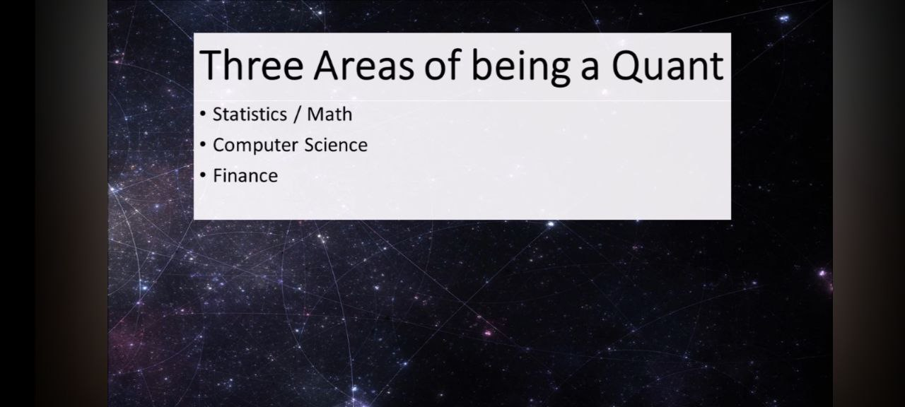

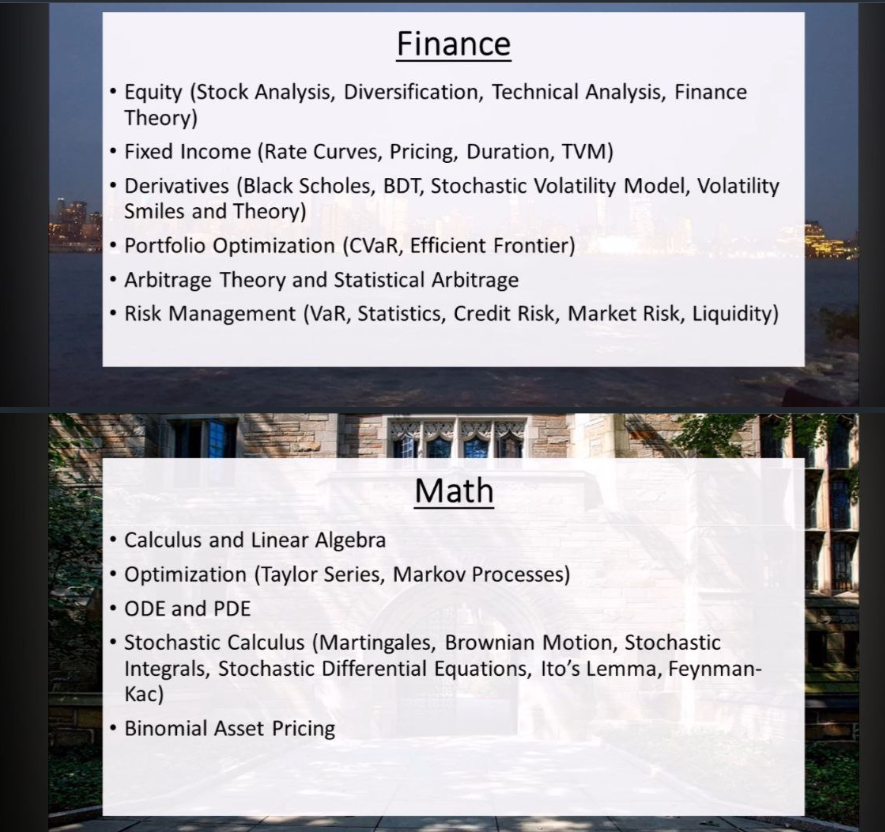

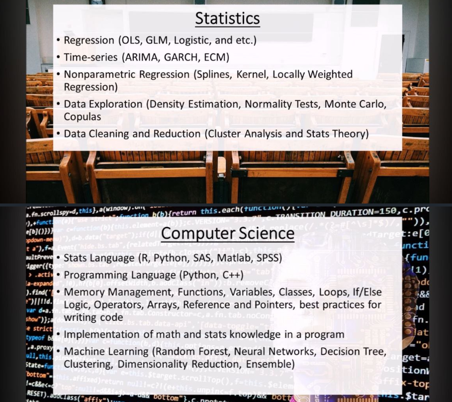

----------------------------------------------------------------------------------------------


## TRADING FUNDAMENTALS RESOURCES

```
=====> PSYCHOLOGIST 🌀 Dr. Steven Burger
=====> 🧨🧨🧨🧨🧨🧨 FinCrime Agent

🌀 David, BULL[When You See It Swing The Bat Hard]
🌀 Daniel
--------------------------------------------
🌀 Kevin
🌀 Photon Trading

🌀 SMB Capital

--------------------------------------------------------------------------------------------------------------------------------------------------------------------------------------------------------------------------------

STOCK EXCHANGE   
🌀 Howard Marks
🌀 Buffet -> Berkshire Hathawa

FOREX EXCHANGE                                                                                                                  
                                                   		   
🌀 Jim Simons -> Medallion Fund
🌀 Alex Gerko -> XTX

                                                                     
🧨 Quant Researcher, Quant Engineer, Quant Trader, Quant Portfolio Manager
🧨🧨🧨  Quant Engineer - LechGrzelak -> https://lechgrzelak.com/


🌀 Quant - Korean Yuppie -> https://www.youtube.com/watch?v=kFiiMymTtO0
🌀 Quant Books - QuantPy -> https://www.youtube.com/watch?v=ZSavDAaKy50
🌀 Quant Resources - Coding Jesus -> https://www.youtube.com/watch?v=cXNL4JKBL6w
```


# FINANCIAL ANALYST PROFESSIONAL


## FOREX COMPANIES
 
```
FUNDED NEXT
FUNDING TRADERS.COM


thelegendstrading.com
SMB Capital


XTX Markets
Renaissance Technologies
Henriot Group => Gamma Delta Fund
```


## STRATEGY SETTINGS

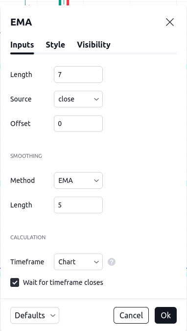
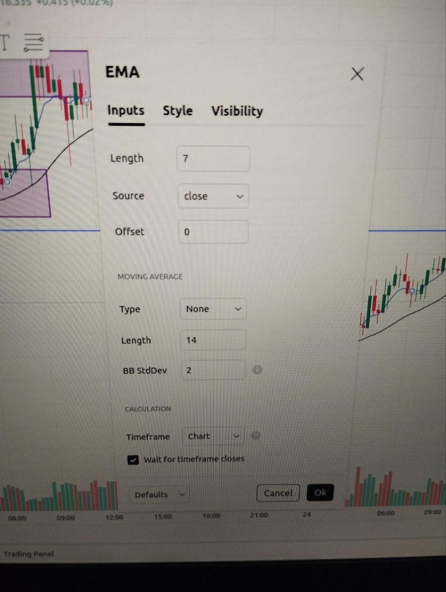

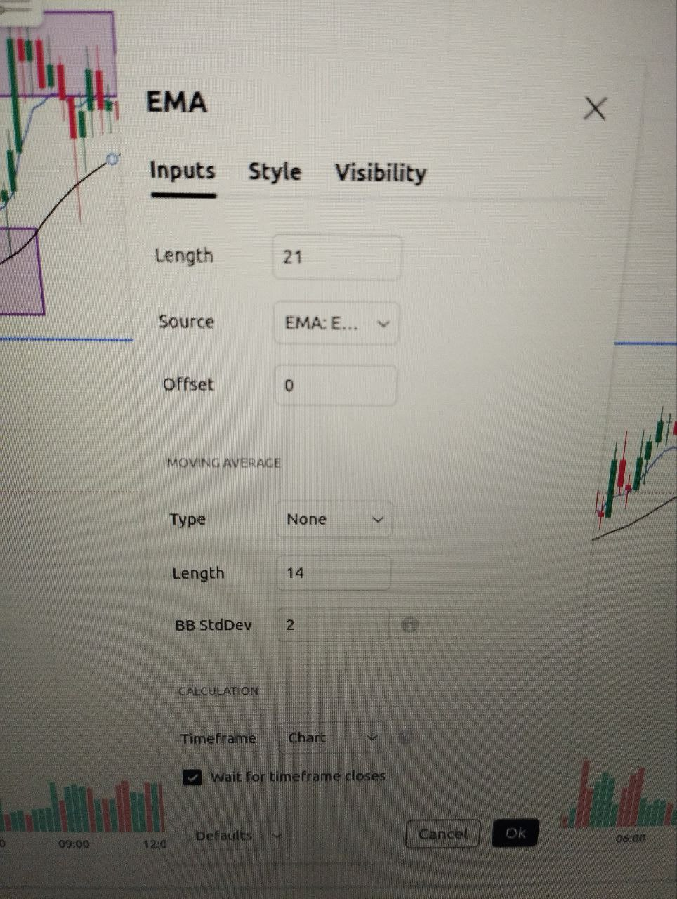

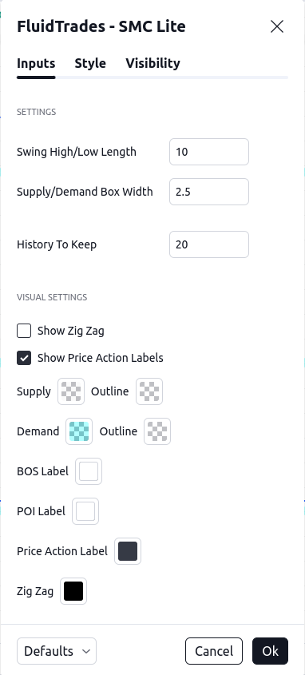
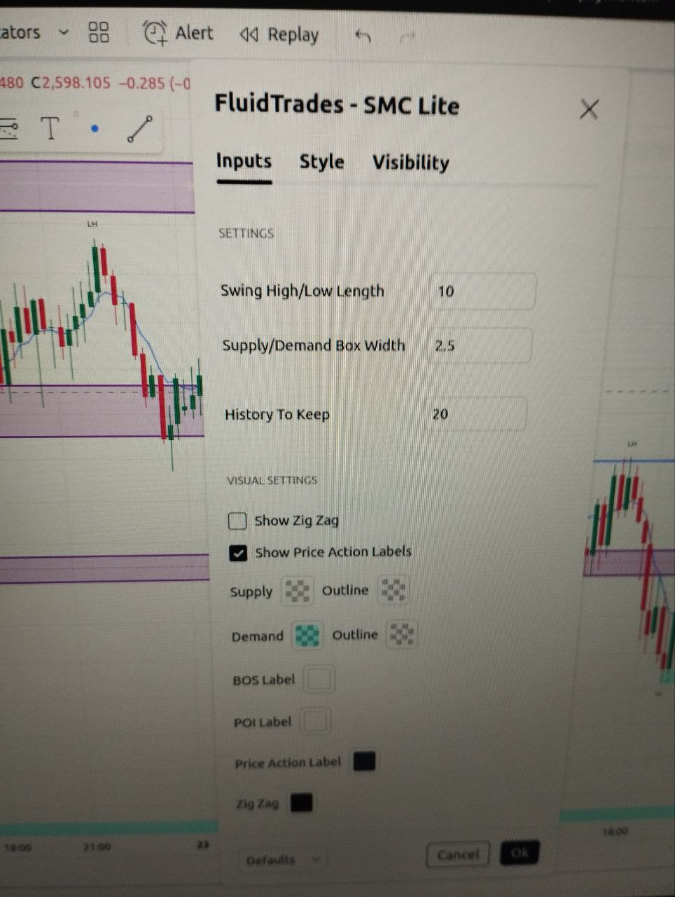


-----------------------------------------------------------------------------------------------

## PLATFORM SETTINGS

```
MT4 3b
Position Sizing + Lot Sizing Formulae ======> 4a
======> Trading Simulator 4a -> Search for Kion Hi 
======> Forex Position Sizing Calculator ---> Adam Khoo


======> Back Test -> Soft4FX, Deriv, GoChatting
======> Identify Strength of Currency -> FX Blue
======> 🧨 Dollar Index => USDX / DXY
======> NEWS -> Forex Factory(Adjust Time to My Local Time and Zone)


======> TRADING -> TradingView
1 GOLD
2 -> Stock
  -> EQUITY -> Derivatives, Options
  -> Currencies ,CFDs


======> Journaling -> [FREE]MyFXbook -> Search for PiranhaProfits Forex Trade Journal [PAID]Edgewonk, Trading Vault


========================================================================================


🧨 MT5 CHART CUSTOMIZATION

SCHEME :  Colour on white
BACKGROUND : Old Lace
FOREGROUND :  Black


========================================================================================


🧨 TRADING VIEW TOOLS

Rectangle
Path
Ellipse
Long Position
Short Position
Trend
Hoizontal Line 
Horizontal Ray
Price Range
```


# ELITE TRADING BEST PRACTICES

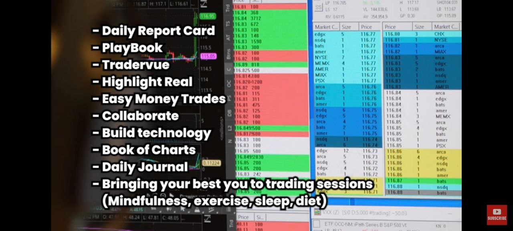


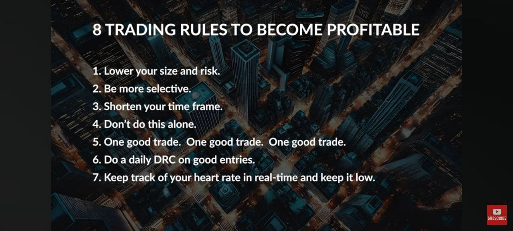


> ===>TRADE VUE PLATFORM 

> HIGHLIGHT REEL

> EASY MONEY TRADE

> DAILY REPORT CARD TRADE

> DAILY TRADING JOURNAL

> DAILY PLAYBOOK  ===> Setup + Entry

-----------------------------------------------------------------------------------------------

### 1 TIME SESSIONS BEST PRACTICES

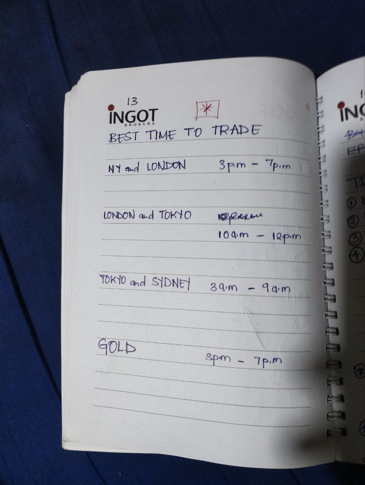

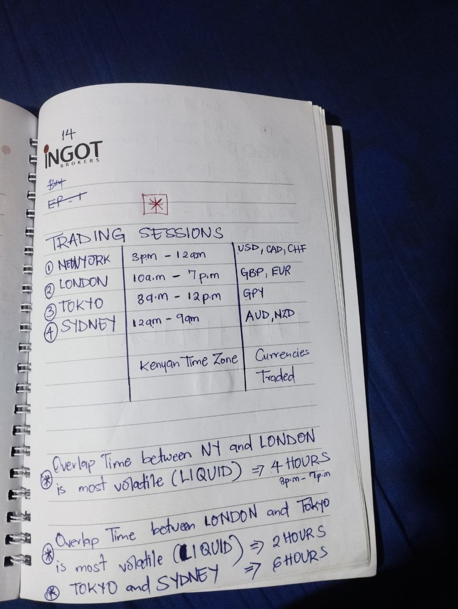

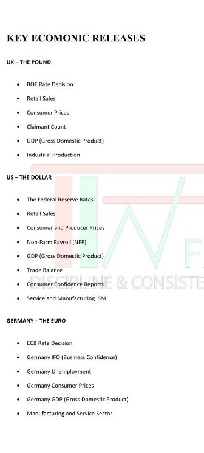


> 4AM

> 8AM - 10AM - 12PM - 1PM

>  3PM - 7PM - 9PM [- 11 PM on ELECTIONS] OR 15:00hrs - 18:00hrs - 21:00hrs [- 23:00hrs on ELECTIONS] 

-----------------------------------------------------------------------------------------------

### 2 TRADE BIAS AND TRADE ENTRY CHECKLIST BEST PRACTICES + FUNDAMENTALS

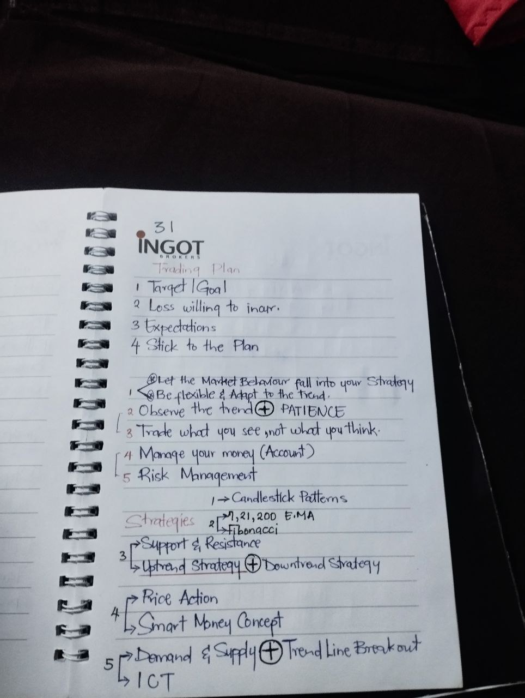


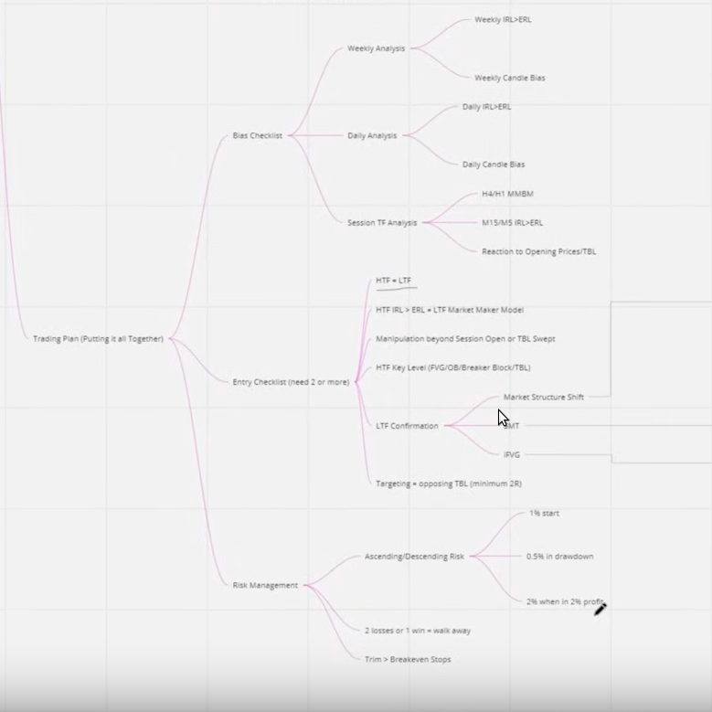

-----------------------------------------------------------------------------------------------

### 3 TRADE PLAN && TRADE RULES | EQUITY MANAGEMENT && RISK MANAGEMENT BEST PRACTICES

> INGOT BROKER

-----------------------------------------------------------------------------------------------

# DAWN STRATEGY BEST PRACTICES

```
🧨🧨🧨🧨🧨 TREND FOLLOWER  => STRATEGIC AND TACTIC
🧨🧨🧨🧨🧨 FINANCIAL INSTITUTION  &&  RETAIL INSTITUTION  👉 OrderBlock + Play Against The Masses 
🧨🧨🧨🧨🧨 GOAL =>
                     ✅ ✅ ✅ LIABLE/RESPONSIBLE for Risk
                     3 # Security Fund -----> SECURITIES[TO BE MINE + INVEST IN MORE ASSETS]
                     2 # Exchange Fund -----> SHOCK ABSORBER[CONTINUOUS TRADING + CASHFLOW]    
                     1 # Investor Fund -----> RISK FREE[RECREATE INVESTOR'S CAPITAL + AGREED PROFIT]
🧨🧨🧨🧨🧨 SECURITY
           INTELLIGENCE + INNOVATION
           [ORDAINED]
                                           [IN HARMONY WITH NATURE] 
                                           AWARENESS
                                           ATTITUDE
                   [CHOSEN]
                   CHARISMATIC
                   EMPATHETIC
                                           [ELECTED]
                                           SKILLS ===> Accurate, [Adapt, Synchronous], [Hardwork 97%]
                                           QUALIFICATIONS                 
```


```
🧨 SECURITY ===> INCREASE IN WEALTH
            ===> HARMONY WITH NATURE

                               🧨 BULL ===> SWING THE BAT
                                       ===> CAREFUL
                                                            🧨 AWARENESS ===> PRICE ---> Detailed
                                                                         ===> TREND ---> Bigger Picture
                                    🧨  DISCIPLINE
                                    > 7
                                    > 21
                                    > GOLDEN RULES
-----------------------------------------------------------------------------------------------------------------------------------------
   🧨🧨🧨 AVOID 1. Price Equilibrium WIDE Consolidation ---> 🧨CLOSE AT PROFIT🧨 , 2. Fundamental LONG Retracement ---> 🧨CLOSE AFTER OBSERVING THE CANDLE STICK🧨 , 3. Swing LONG Reversal <====>  FUNDAMENTAL BREAKOUT
   ✅ TRADE 1. BREAKOUT, 2. RETEST, 3. FUNDAMENTAL RETEST ***ONLY***
-----------------------------------------------------------------------------------------------------------------------------------------

                                                            🧨 PATIENCE ===> CONFIRMATION CANDLESTICK ---> Entry                 
                                                                        ===> TARGET ---> Exit  
```


```

                                                           ✅ AWARENESS
                                                           1. Swing the BAT
                                                           2. CAREFUL
                                                           3. TARGET
✅ TREND STRATEGY                                                                           ✅ PRICE STRATEGY
EMA [7,21]                                                                                  ICT => PD-Array  5AM [15MIN,30MIN,1HR]    
Price Action                                                                                SMC
---------------------------------------------------------------                             --------------------------------------------------------------- 
Rich Nick [DEMAND AND SUPPLY STRATEGY (ICT) 👉👉👉👉👉 CALCULATING TAKE PROFIT/TARGET]      Rich Nick  [DEMAND AND SUPPLY STRATEGY (ICT) 👉👉👉👉👉 CALCULATING TAKE PROFIT/TARGET]
Financial Institution + Retail  Institution 👉 OrderBlock + Play Against The Masses         Financial Institution + Retail  Institution  👉 OrderBlock + Play Against The Masses 
Fundamental                                                                                 Fundamental

```


```
            💡 STUDY 
💡 RESEACH         💡 DEMO TRADE    <===>     💡 ACTUAL TRADE
```


```
* FBS 1:1000 For VERY Short Duration Trade ===> XAU/USD && PRICE EMPHASIS STRATEGY
-----------------------------------------------------------------------------------------------
1 LARGE CASH For Long Duration Trade ===> XAU/USD && TREND EMPHASIS STRATEGY
2 GOD'S GRACE For Short and Long Duration Trade ===> XAU/USD && PRICE AND TREND EMPHASIS STRATEGY
3 SMALL CASH For Short Duration Trade ===> XAU/USD && Price  EMPHASIS STRATEGY
```


```
✅ ✅ ✅ CONSISTENCY | DISCIPLINE | PATIENCE ✅ ✅ ✅ 
✅ ✅ ✅ Lot Sizing Tips (FUND / MONEY / ASSET MANAGEMENT) Credit: Nick Pot Analogy ✅ ✅ ✅

--------------------------------------------------------------------------------
* LARGE CASH FBS 1:1000 For VERY Short Duration Trade ===> XAU/USD && PRICE EMPHASIS STRATEGY
>>>>>>>>>>>>>>>>>>>>   Ksh. 200,000 = 5 LOT   <<<<<<<<<<<<<<<<<<<<<<<<<<
>>>>>>>>>>>>>>>>>>>>  pep 1:1000  <<<<<<<<<<<<<<<<<<<<<<<<<<
--------------------------------------------------------------------------------
1 LARGE CASH For Long Duration Trade ===> TREND EMPHASIS STRATEGY
>>>>>>>>>>>>>>>>>>>>   Ksh. 1M = 5 LOT   <<<<<<<<<<<<<<<<<<<<<<<<<<
>>>>>>>>>>>>>>>>>>>>  pep 1:400  <<<<<<<<<<<<<<<<<<<<<<<<<<
>>>>>>>>>>>>>>>>>>>>  ex 1:300  <<<<<<<<<<<<<<<<<<<<<<<<<<
--------------------------------------------------------------------------------
2 GOD'S GRACE For Short and Long Duration Trade ===> PRICE AND TREND EMPHASIS STRATEGY
>>>>>>>>>>>>>>>>>>>>   Ksh. 200,000 = 5 LOT   <<<<<<<<<<<<<<<<<<<<<<<<<<
>>>>>>>>>>>>>>>>>>>>  pep 1:200  <<<<<<<<<<<<<<<<<<<<<<<<<<
>>>>>>>>>>>>>>>>>>>>  ex 1:100  <<<<<<<<<<<<<<<<<<<<<<<<<<
--------------------------------------------------------------------------------
3 SMALL CASH For Short Duration Trade ===> Price  EMPHASIS STRATEGY
>>>>>>>>>>>>>>>>>>>>   Ksh. 50,000 = 2 LOT   <<<<<<<<<<<<<<<<<<<<<<<<<<
>>>>>>>>>>>>>>>>>>>>  pep 1:100  <<<<<<<<<<<<<<<<<<<<<<<<<<
>>>>>>>>>>>>>>>>>>>>  ex 1:100  <<<<<<<<<<<<<<<<<<<<<<<<<<
--------------------------------------------------------------------------------

```


---------------------------------


```
50 usd :-
High risk = 0.10 lot
Mid risk = 0.05 lot
Low risk = 0.01 lot

100 usd :-
High risk = 0.20 lot
Mid risk = 0.10 lot
Low risk = 0.01 lot

200 usd :-
High risk = 0.40 lot
Mid risk = 0.20 lot
Low risk = 0.02 lot

500 usd :- 
High risk = 1.00 lot
Mid risk = 0.50 lot
Low risk = 0.05 lot

1000 usd :-
High risk = 2.00 lot
Mid risk = 1.00 lot
Low risk = 0.10 lot

If you have an amount that is different from the amount above. Take the amount that is closest to the amount above and try to calculate.
```


```
 NEWS ANALYSIS


💡 **Notion Tip:** Create a new page and select `Daily entry` ****from the list of template options to automatically generate the format below every day


✅ ✅ ✅ NFP (non Farm Payroll)- non farm professionals ✅ ✅ ✅

-we avoid trading a day prior it because there is a cloud in price that prevents clarity in price and demanding that high level of degree of clarity would be a mayhem

-in NFP price tends to attack the nearest liquidity pool and if prior the release of the news there was that Orderflow in price nfp may tend to break that monotony not all the times but most of the times 

-and here price respects HTF PD arrays not with the highest degree of precision but price may overshoot it with some few handles 


✅ ✅ ✅ FOMC & FEDERAL FUND RATE ✅ ✅ ✅

-It is normally released at 2pm ET 

-if there are no news in the morning session its advisable to avoid trading the morning session prior fomc but if there is some clarity in price you can execute on the trade and be out of the market place before 10:30 go for the low hanging fruit objective

-in this price respects HTF OF  with that high degree of precision and our main target is the low hanging fruit objective dont be overzealous 

-when feds are speaking price does not reprice as a result of price reacting to what they have said but their words are just utilized  as a smoke screen to make price vulgar by the market makers

-we trade at the last hour macro because price may trade softer


✅ ✅ ✅ CPI NUMBER ✅ ✅ ✅

This is a straight bullet where liquidity is purged..it necessarily does not have to be that macro other macros can also be incorporated of the other news.. this is just what is normally anticipated for price to do.. its not the beyond end all panacea
```


```
🧨🧨🧨🧨🧨🧨🧨🧨🧨🧨🧨🧨🧨🧨🧨🧨🧨🧨🧨🧨🧨🧨🧨🧨🧨🧨🧨🧨🧨🧨🧨🧨🧨🧨🧨🧨🧨🧨🧨🧨🧨🧨🧨🧨🧨🧨🧨🧨🧨🧨🧨🧨🧨🧨🧨🧨🧨🧨🧨🧨🧨🧨🧨🧨🧨

>>> TRADING VIEW TOOLS
Indicators [EMA] 7 && 21
FluidTrades - SMC Lite
Fibonnacci


=======================================================================================================================================

👉 ****FOREX BACKUP*****
👉 ****INGOT BROKER NOTES*****
👉 ****HFM BROKER NOTES*****
👉 ****PHOTON TRADING NOTES*****
👉 ****KEVIN SUMMARY NOTES*****


🧨🧨🧨 SMART [Specific|Measurable|Achievable|Realistic|Time Bound] 🧨🧨🧨

---------------------------------------------------------

🧨🧨🧨 BEST <---> MARKETABLE <---> IRREPLACABLE 🧨🧨🧨

---------------------------------------------------------

🧨🧨🧨 RESPECT LAWS + MANAGE RESOURCES + RISK MANAGEMENT 🧨🧨🧨


=======================================================================================================================================


🧨🧨🧨🧨🧨🧨🧨🧨🧨 GOLDEN TRADING RULES 🧨🧨🧨🧨🧨🧨🧨🧨🧨
🧨🧨🧨🧨🧨🧨🧨🧨🧨 OPPOSITE IS TRUE AND RESULTS TO A LOSS WHEN PLACING TRADES 🧨🧨🧨🧨🧨🧨🧨🧨🧨

1 Subscribe to an A Booking Broker ===> OPPOSITE is a B Booking Broker 
2 ===> PSYCHOLOGY ===> Large Deposit, Large Lot size, Large Leverage | Small Deposit, Small Lot size, Small Leverage
3 Always use Trailing Take Profit and Stop Loss(Modify Take Profit and Stop Loss)

-----------------------------------------------------------------------------------------------------------------------------------------
******🧨 FX BLUE ==> AWARE of BASE CURRENCY STRENGTH [USD] 🧨******
******🧨 FOREX FACTORY https://www.forexfactory.com/ ==> AWARE of FUNDAMENTALS [Economic News, Fed Speech, Politics, Natural Calamities] 🧨******
******🧨 NOT EVERY DAY IS A TRADING DAY, YOU DON'T HAVE TO PLACE A TRADE, HENCE SAVE MONEY IN YOUR ACCOUNT <-----> ONLY PLACE QUALITY TRADES 🧨******


👉👉👉👉👉👉👉👉👉👉👉👉👉 🧨🧨🧨 RESOURCE MANAGEMENT + TRADING EDGE ONLY PLACE QUALITY TRADES  && A + TRADES 🧨🧨🧨

👉👉👉👉👉👉👉👉👉👉👉👉👉 🧨🧨🧨 ONLY Trade CANDLESTICK + TRADE ON LARGE SCREEN + CANDLESTICK TIME PERIOD 🧨🧨🧨

   🧨 15 MIN [FIRST 5 MIN => OBSERVATION] [10 MIN => ACTUAL TRADE]
   🧨 First Three Candlesticks -> High Probability Trades | High Profit| Low Risk
   🧨 AFTER First Three Candlesticks -> Less Probability Trades | Low Profit| High Risk

   ✅ TRADE ON TWO FULL SCREEN -----> PRICE EMPHASIS -----> TREND EMPHASIS
   ✅ REQUIRES FULL ATTENTION
   ✅ BODY TELLS THE STORY, WICK TELLS THE DESTRUCTION

   ✅ TRADE AS    👉 -----> SMART MONEY INSTITUTIONS TRADER
                  👉 -----> RETAIL TRADER
-----------------------------------------------------------------------------------------------------------------------------------------
   ✅ 🌀 DAY TRADER => HAVE [TARGET + ORIGIN PRICE] && TRUST YOUR STRATEGY 🌀 MEDIUM SCALE TRADE  🌀 LARGE SCALE TRADE
   ✅ 0.5 VERY LONG TRADES [VERY LARGE SCALE] 
   ✅ 1.0 LONG TRADES ===> RETEST / PULLBACK [MEDIUM & LARGE SCALE]
   ✅ CLOSE TRADES AT 1PM
   ✅ THEN TRADE BREAKOUT && RETEST / PULLBACK

-----------------------------------------------------------------------------------------------------------------------------------------
   🧨🧨🧨 AVOID 1. Price Equilibrium WIDE Consolidation ---> 🧨CLOSE AT PROFIT🧨 , 2. Fundamental LONG Retracement ---> 🧨CLOSE AFTER OBSERVING THE CANDLE STICK🧨 , 3. Swing LONG Reversal <====>  FUNDAMENTAL BREAKOUT
   ✅ TRADE 1. BREAKOUT, 2. RETEST, 3. FUNDAMENTAL RETEST ***ONLY***
-----------------------------------------------------------------------------------------------------------------------------------------
   ✅ LOT SIZE/ CONTRACT SIZE
   1 TOTAL VOLUME LOT SIZE
   2 NUMBER OF ORDERS PLACED && 🧨EQUIVALENT TO FUNDS IN YOUR ACCOUNT🧨
   3 MARGIN RATIO && 🧨ALLOWANCE🧨 IN NUMBER OF ORDERS PLACED CREATING ROOM FOR RETRACEMENT    ------> PEPPERSTONE 1:300
                                                                                               ------> EXNESS 1:200
-----------------------------------------------------------------------------------------------------------------------------------------


+++++++++++++++++++++++++++++++++++++++++++++++++++++++++++++++++++++++++++++++++++++++++++++++++++++++++++++++++++++++++++++++++++++++++++++++++++++++++++++++++++++++++++++++++++++++++++++++++++++++++++++++++++++++++++


-------------------------------------------------------------------------------------------------------------------------------
******🧨 DO NOT EXCHANGE MONEY WITH LIQUID PROVIDER, ONCE PRICE HAS REACHED HIGHEST POINT,  EXIT TRADE 🧨******
******🧨 DO NOT TRADE RESISTANCE, SUPPORT🧨******
******🧨 DO NOT TRADE ORDER BLOCK && PRICE EQUILIBRIUM 🧨******
******🧨 DO NOT TRADE STOP LOSS HUNT[BUY, SELL, BUY STOP, SELL STOP], LIQUIDITY SWEEP For Example: HIGHEST POINT => BEAR TRAP OR LOWEST POINT => BULL TRAP 🧨******
******🧨 9. AVOID THESE CANDLESTICKS 🧨******
   ====> DO NOT Trade small wick and small body
   ====> DO NOT Trade very large wick on both sides and small body
   ^^^^^^^^^^^^^^^^^^^^^^^^^^^^^^^^^^^^^^^^^^^^^^^^
   ====> DO NOT Trade CONSOLIDATION small wick and small body
   ====> DO NOT Trade Doji Candlestick / Indecision / Equal Sellers and Buyers Volumes
-------------------------------------------------------------------------------------------------------------------------------

🧨 FUNDAMENTAL ====> 2 MINUTES FOR ENTRY, CHECK ANALYSIS ON 15 MINUTES, FOREX FACTORY *** REFRESH ***  1 MIN AND 30 SECONDS 🧨
🧨 % FOR SPIKE == WICK, K FOR MOVEMENT == BODY 🧨
🧨 PLACE TRADE WHEN  BODY IS FORMED 🧨
========================================================
🧨 NORMAL DAY  ====> 15 MINUTES FOR ENTRY, CHECK ANALYSIS ON 4HR, 1HR, 1DY, 1WK, 1MTH 🧨
========================================================
Higher Time Frame    Lower Time Frame
	W		H4
	D		H1
	H4		M15
	H1		M5
	M15		M1
-------------------------------------------------------------------------------------------------------------------------------
4. Trade after a FUNDAMENTAL.
5. Trade what you see not what you think.
6. Trade in harmony with the Trend not AGAINST.
7. Be PATIENT with the trading market then PLACE YOUR TRADE
8. Trade AFTER a CONFIRMATION CANDLESTICK

🧨 9. TRADE SETUP + ENTRY + [NOT EVERY DAY IS A TRADING DAY]

------------------------------------------------------------------------------------------------------------------------------------------------------------------------------------------------------


%%%%%%%%%%%%%%%%%%%%%%%%%%%%%%%%%%%%%%%%%%%%%%%%%%%%%%%%%%%%%%%%%%%%%%%%%%%%%%%%%%%%%%%%%%%%%%%%%%%%%%%%%%%%%%%%%%%%%%%%%%%%%%%%%%%%%%%%%%%%%%%%%%%%%%%%%%%%%%%%%%%%%%%%%%%%%%%%%%%%%%%%%%%%%%%%%%%%%%%%%%%%%%%%%%%%%%%%%%%%%%%%%%%%%%%%%%%%%%


-------------------------------------------------------------------------------------------------------------------------------
   🧨 LOT SIZE

👉👉👉 15 MIN TIME-FRAME

   👉 0.1 and 0.2 => SMALL momentum/displacement 
   👉 0.5 => MEDIUM momentum/displacement
========================================================================== 
   👉 1.0 => HIGH momentum/displacement => FUNDAMENTAL ===> M CAPITAL

*******************************************************************************************************************************
👉👉👉 1 MIN TIME-FRAME
    
   👉 🧨2.5 OR 3.0 => HIGH momentum/displacement => FUNDAMENTAL ===> B CAPITAL - 🧨1 MIN TIME-FRAME🧨
   👉 🧨4.5 OR 5.0 => HIGH momentum/displacement => FUNDAMENTAL ===> T CAPITAL - 🧨1 MIN TIME-FRAME🧨


   
   👉👉👉 🧨 TIME-FRAME [15 MINUTES] ELECTIONS[POLITICS] FUNDAMENTAL
   => 0.5 10MIN->5MIN
   => AIM for Specific Target Price AND / OR Order Block
==========================================================================
   🌀 SCALPER => DON'T EXCHANGE MONEY WITH LIQUIDITY PROVIDER / MARKET MAKER 🌀 SMALL SCALE 🌀
   ✅ 1.0 LONG TRADES ===> RETEST / PULLBACK [SMALL SCALE]
   => 1.0 13MIN -10MIN and @@@@@@@@@@@@ Guided by PREVIOUS CANDLESTICK + 10MIN->0MIN->PD ARRAY / Target Price @@@@@@@@@@@@
   => AIM for Specific Target Price AND / OR Order Block


   
   🧨 TIME-FRAME [15 MINUTES]  🧨SMALL+EASY MONEY🧨
   => 0.5 13MIN->10MIN
   => AIM for Specific Target Price AND / OR Order Block
========================================================================== 
   => 🧨1.0 13MIN->10MIN [INVERTED HAMMER / SHOOTING HAMMER]
   => AIM for Specific Target Price AND / OR Order Block


%%%%%%%%%%%%%%%%%%%%%%%%%%%%%%%%%%%%%%%%%%%%%%%%%%%%%%%%%%%%%%%%%%%%%%%%%%
 🧨🧨🧨AVOID🧨🧨🧨 1 MIN TIME-FRAME FUNDAMENTAL 🧨BREAKOUT🧨
   => 1.0 
   => AIM for Specific END OF I MIN
==========================================================================
   🌀 SCALPER => DON'T EXCHANGE MONEY WITH LIQUIDITY PROVIDER / MARKET MAKER 🌀 SMALL SCALE 🌀
   ✅ 1.0 LONG TRADES ===> RETEST / PULLBACK [SMALL SCALE]
👉👉👉 AFTER FUNDAMENTAL 🧨PULLBACK / RETEST🧨
   => 1.0 13MIN -10MIN and @@@@@@@@@@@@ Guided by PREVIOUS CANDLESTICK + 10MIN-5MIN-PD ARRAY / Target Price @@@@@@@@@@@@
   => AIM for Specific Target Price AND / OR Order Block
%%%%%%%%%%%%%%%%%%%%%%%%%%%%%%%%%%%%%%%%%%%%%%%%%%%%%%%%%%%%%%%%%%%%%%%%%%


   🧨 CANDLESTICK OBSERVATION
   WHY  => Candlestick Duration / Time Period To Form 
       👉 Less Time To Form => LARGE Candlestick
       👉 More Time To Form => SMALL Candlestick
   HOW  => Candlestick Behaviour => IMPULSIVE or NOT
   WHAT => Candlestick Previous Patterns
       👉 BODY tells Story and WICK tells Destruction

   🧨 ORDER BLOCK OBSERVATION
       👉 1 Resistance
       👉 2 Price Equilibrium / Fibonacci
       👉 3 Support


-------------------------------------------------------------------------------------------------------------------------------


👉 Trade Setup
👉 Trade Timing
👉 Trade Style
👉 Trade Structure ===> Entry and Exit
👉 BULL ===> [When You See It Swing The Bat Hard]


👉 MANAGE YOUR RESOURCES
👉 RISK MANAGEMENT

------------------------------------------------------------------------------------------------------------------------------------------------------------------------------------------------------

👉👉👉👉👉👉👉👉👉👉👉👉👉 🧨🧨🧨 RESOURCE MANAGEMENT + RISK MANAGEMENT 🧨🧨🧨

✅ ✅ ✅  ELECTIONS ✅ ✅ ✅
👉 [ 1 LOT ] BULL ===> Multiple Orders                      👉 STOP LOSS + 10 PIPS [ No TP + CLOSE ALL TRADES ] A* TRADE

    
🧨🧨🧨🧨🧨🧨🧨🧨🧨🧨🧨🧨🧨🧨🧨🧨🧨🧨🧨🧨🧨🧨🧨🧨🧨🧨🧨🧨🧨🧨🧨🧨🧨🧨🧨🧨🧨🧨🧨🧨🧨🧨🧨🧨🧨🧨🧨🧨🧨🧨🧨🧨🧨🧨🧨🧨🧨🧨🧨🧨🧨🧨🧨🧨🧨
```


========================================================================================================================================================================================================================

# XAU/USD EMPHASIS

### 1ST -> PRICE STRATEGY

```
🧨 >>> ORIGINAL PRICE
🧨 >>> TARGET PRICE
```

### 2ND -> TIME STRATEGY

```
🧨🧨🧨 5AM 15MIN  CANDLESTICK / PD-ARRAY => OBEYS [BUY-SIDE/SELL-SIDE LIQUIDITY] + [PREMIUM/DISCOUNT PRICE LEVEL]
🧨🧨🧨 5AM 30MIN  CANDLESTICK / PD-ARRAY => OBEYS [BUY-SIDE/SELL-SIDE LIQUIDITY] + [PREMIUM/DISCOUNT PRICE LEVEL]
🧨🧨🧨 5AM 1HR  CANDLESTICK / PD-ARRAY => OBEYS [BUY-SIDE/SELL-SIDE LIQUIDITY] + [PREMIUM/DISCOUNT PRICE LEVEL]

🧨🧨🧨 ✅ INDECISION CANDLESTICK / PROPULSION PD-ARRAY
🧨🧨🧨 ✅ PREMIUM PRICE AND DISCOUNT PRICE
```

### 3RD -> EMA STRATEGY + GOLDEN RULES

```
> 7
> 21
> GOLDEN RULES
-----------------------------------------------------------------------------------------------------------------------------------------
   🧨🧨🧨 AVOID 1. Price Equilibrium WIDE Consolidation ---> 🧨CLOSE AT PROFIT🧨 , 2. Fundamental LONG Retracement ---> 🧨CLOSE AFTER OBSERVING THE CANDLE STICK🧨 , 3. Swing LONG Reversal <====>  FUNDAMENTAL BREAKOUT
   ✅ TRADE 1. BREAKOUT, 2. RETEST, 3. FUNDAMENTAL RETEST ***ONLY***
-----------------------------------------------------------------------------------------------------------------------------------------
```

### 4TH -> FIBONACCI STRATEGY

```
> ALL HFM BROKER FIBONACCI STRATEGIES 
```

# TREND EMPHASIS

### 1ST -> SMC STRATEGY

```
> SMART MONEY CONCEPT (SMC) STRATEGY 

> [XAU/USD 3AM TIME + TIME-ZONE] BASED LIQUIDITY (TBL) STRATEGY 

> Buy-Side Liquidity STRATEGY ==> BUY-STOP LOSS  HUNT

> Sell-Side Liquidity STRATEGY ==> SELL-STOP LOSS  HUNT

> SWING HIGH STRATEGY ---> PREMIUM PRICE

> SWING LOW STRATEGY ---> DISCOUNT PRICE

> PRICE EQUILIBRIUM
```

### 2ND -> DEMAND AND SUPPLY STRATEGY (ICT) 👉👉👉👉👉 CALCULATING TAKE PROFIT/TARGET

```
> PRICE ACTION BASED ON MARKET STRUCTURE AND TIME INTERVAL[30MIN,DY,WK,MTH] STRATEGY
```

### 3RD -> EXPONENTIAL MOVING AVERAGES STRATEGY

```
> 7
> 21
> GOLDEN RULES
-----------------------------------------------------------------------------------------------------------------------------------------
   🧨🧨🧨 AVOID 1. Price Equilibrium WIDE Consolidation ---> 🧨CLOSE AT PROFIT🧨 , 2. Fundamental LONG Retracement ---> 🧨CLOSE AFTER OBSERVING THE CANDLE STICK🧨 , 3. Swing LONG Reversal <====>  FUNDAMENTAL BREAKOUT
   ✅ TRADE 1. BREAKOUT, 2. RETEST, 3. FUNDAMENTAL RETEST ***ONLY***
-----------------------------------------------------------------------------------------------------------------------------------------
```
---------------------

### 4TH -> PRICE ACTION STRATEGY

```
> ALL HFM BROKER PRICE ACTION STRATEGIES
```


# PRICE EMPHASIS

### 1ST -> SMC STRATEGY

```
> SMART MONEY CONCEPT (SMC) STRATEGY 

> [XAU/USD 3AM TIME + TIME-ZONE] BASED LIQUIDITY (TBL) STRATEGY 

> Buy-Side Liquidity STRATEGY ==> BUY-STOP LOSS  HUNT

> Sell-Side Liquidity STRATEGY ==> SELL-STOP LOSS  HUNT

> SWING HIGH STRATEGY ---> PREMIUM PRICE

> SWING LOW STRATEGY ---> DISCOUNT PRICE

> PRICE EQUILIBRIUM
```

### 2ND -> ICT STRATEGY 

```
> ALL HFM BROKER ICT STRATEGIES + GITHUB README
```

### 3RD -> FIBONACCI STRATEGY 

```
> ALL HFM BROKER FIBONACCI STRATEGIES 
```

------

# INDICES STRATEGY

```
> FVG
> Open Interest
> Weekly Encroachment
> PRICE ACTION EXPERIENCE
```

 @@@@@@@@@@@@@@@@@@@@@@@@@@@@@@@@@@@@@@@@@@@@@@@@@@@@@@@@@@@@@@@@@@@@@@@@@@@@@@@@@@@@@@@@@@@@@@@@@@@@@@@@@@@@@@@@@@@@@@@@@@@@@@@@@@@@@@@@@@@@@@@@@@@@@@@@@@@@@@@@@@@@@@@@@@@@@@@@@@@@@@@@@@@@@@@@@@@@@@@@@@

# ICT STRATEGY

```
> LOT SIZE => CONTRACT SIZE

> PD-ARRAY => Price level in which price react to Bullish or Bearish

> OPEN INTEREST => Total number of Future Contracts HELD/OPEN by market participants at the end of a day

> SLIPPAGE => During FUNDAMENTALS Affects Take Profit and Stop Loss


> RANGE / CONSOLIDATION / CHOPPY

> MOMENTUM / DISPLACEMENT Candlestick

> IMPULSIVE / EXPANSION 

> RETRACEMENT

> REVERSAL / MARKET SHIFT

> MARKET STRUCTURE / OVERALL MARKET TREND

> IMPULSIVE PRICE SWING (High / Low)

> FAKE-OUTS


> FAIR VALUE GAP

> VOLUME IMBALANCE

> GAP


> LIQUIDITY POOL / LIQUIDITY SWEEP

> LIQUIDITY VOID

> LIQUIDITY RUN

> STOP RUN

> HIGH RESISTANCE LIQUIDITY RUN => 79% and Higher Fibonnacci

> LOW RESISTANCE LIQUIDITY RUN => 50% and Lower Fibonnacci


> PRICE EQUILIBRIUM / FIBONACCI / FAIR VALUATION

> EQUILIBRIUM PRICE vs DISCOUNT PRICE(BUYERS) / EQUILIBRIUM PRICE vs PREMIUM PRICE(SELLERS)

> AIM for (79% - Reversal)

> PRICE DELIVERY =====> Expansion  ->  Retracement  ->  Reversal  ->  Consolidation  ->  Expansion  ->  REPEAT

> PRICE DELIVERY =====> Accumulation  ->  Manipulation  ->  Distribution


> 1ST The Inner Circle Trader Channel <======> 5MARKET MAKER , 3PRECISION CONCEPTS,  SNIPER => 3SCALPING 2OPTIMAL TRADE ENTRY

> 2ND 2016 ICT Private Mentorship Core Con <======> PRICE DELIVERY =====> Expansion -> Retracement -> Reversal -> Consolidation -> Expansion-> REPEAT

> 2022 MENTORSHIP

> 2023 MENTORSHIP

> 2024 MENTORSHIP

> 2025 MENTORSHIP
```

 ----------------------------

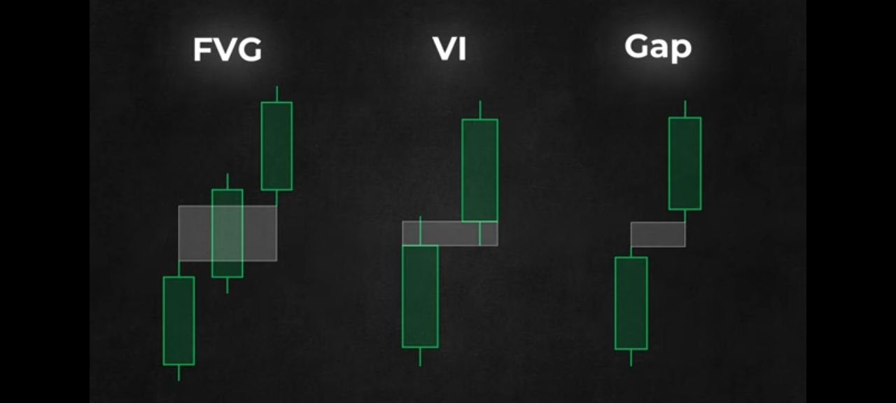
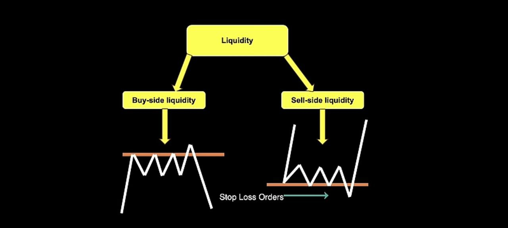
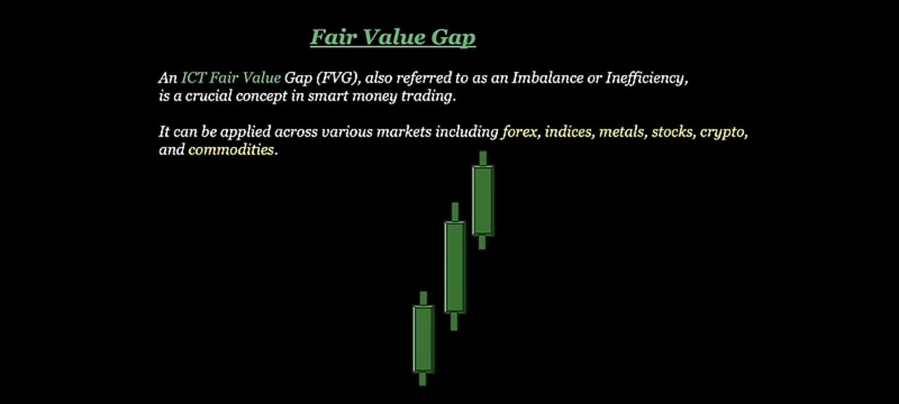
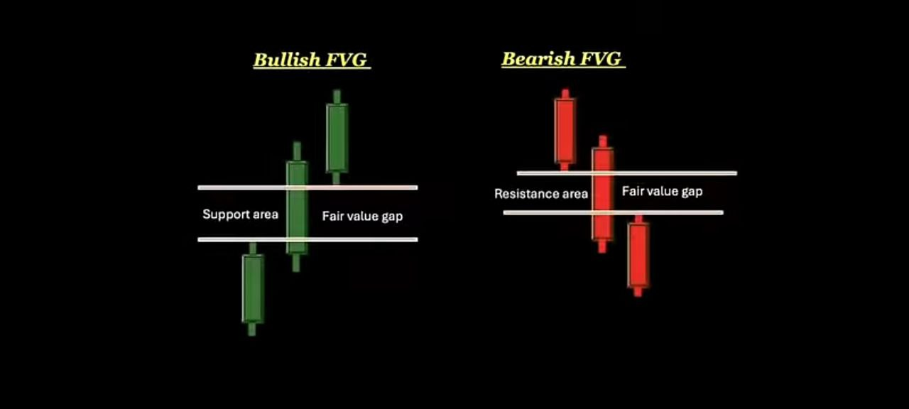
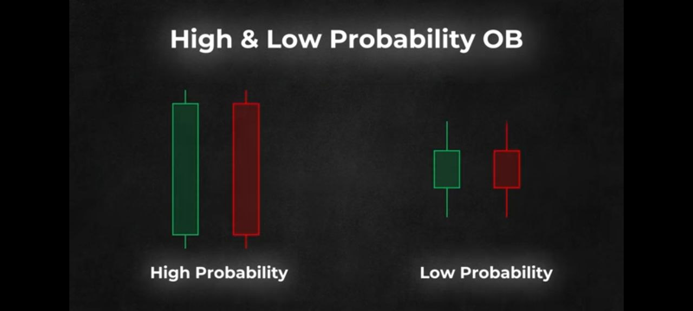
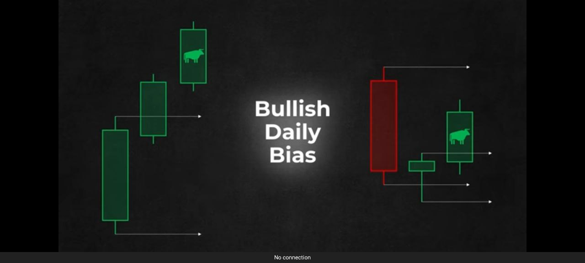
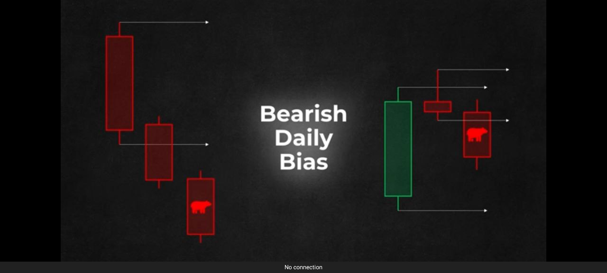
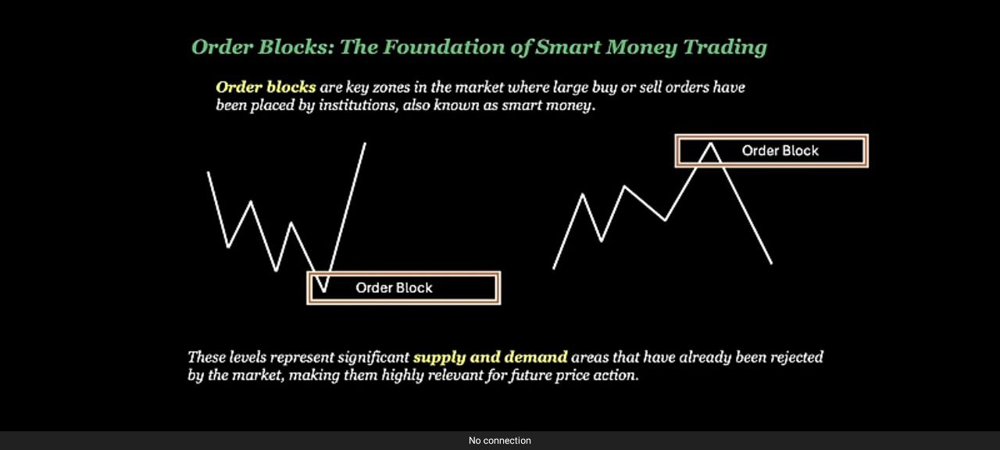
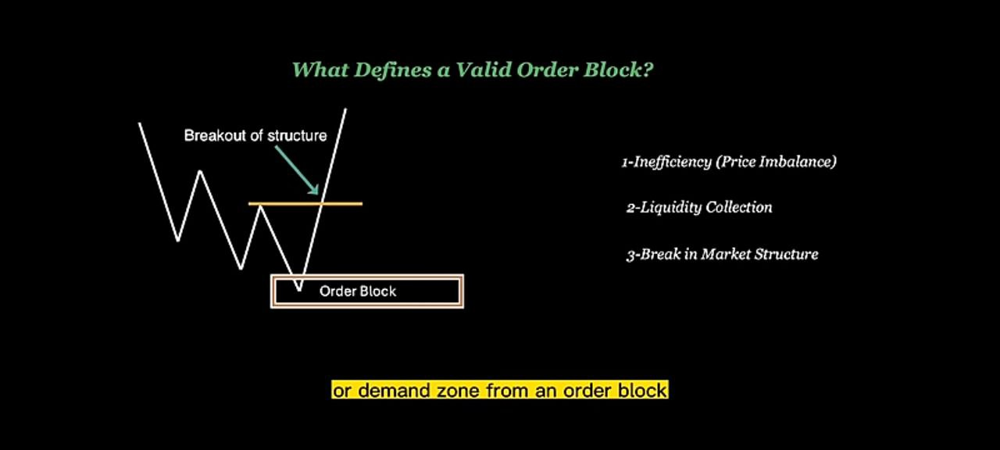
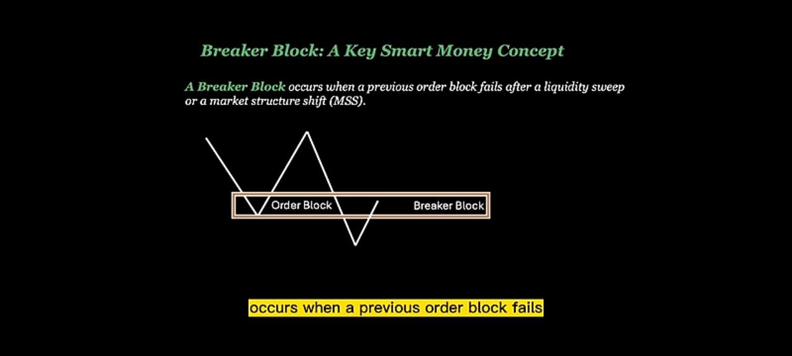
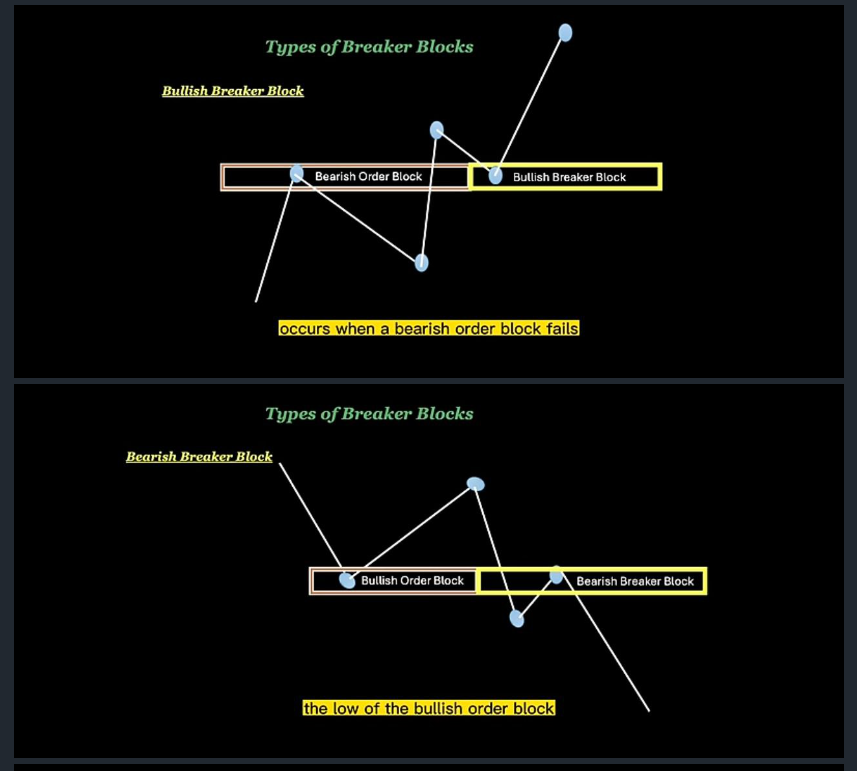
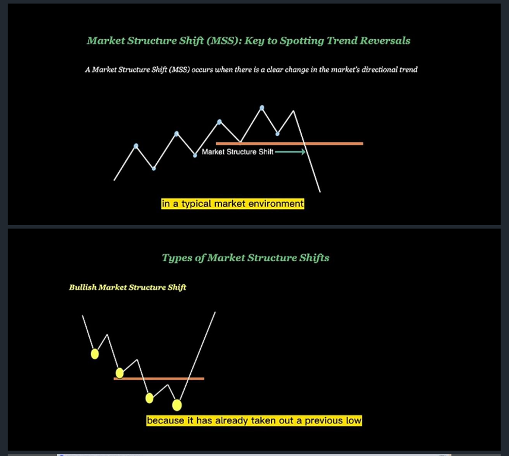
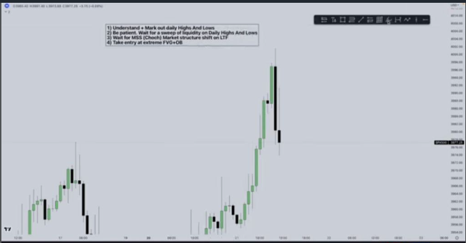


# XAU/USD

### BUY-SIDE LIQUIDITY AND SELL-SIDE LIQUIDITY

👉👉👉👉👉 Buy-side liquidity cleared out then price dumps lower for Sell-side liquidity


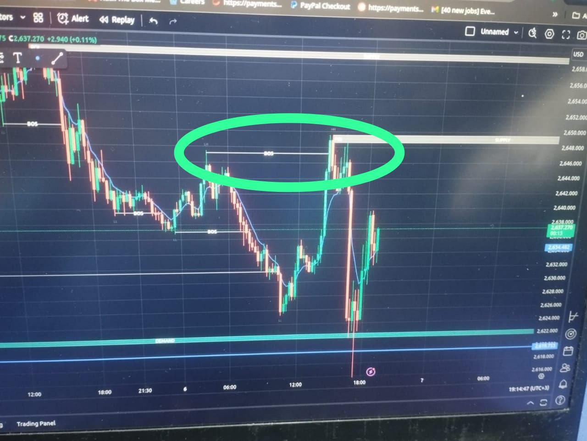
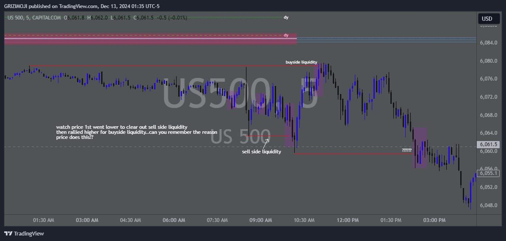
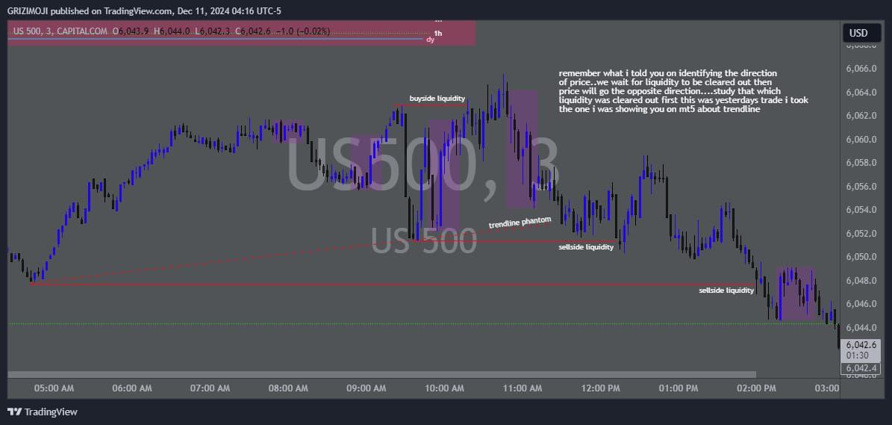
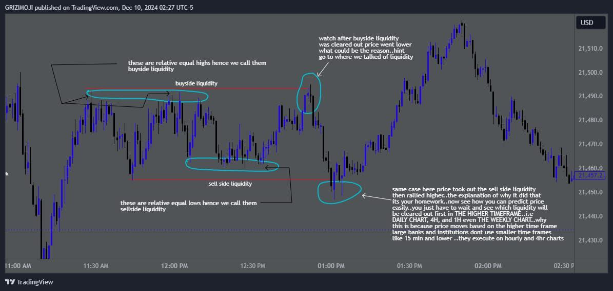
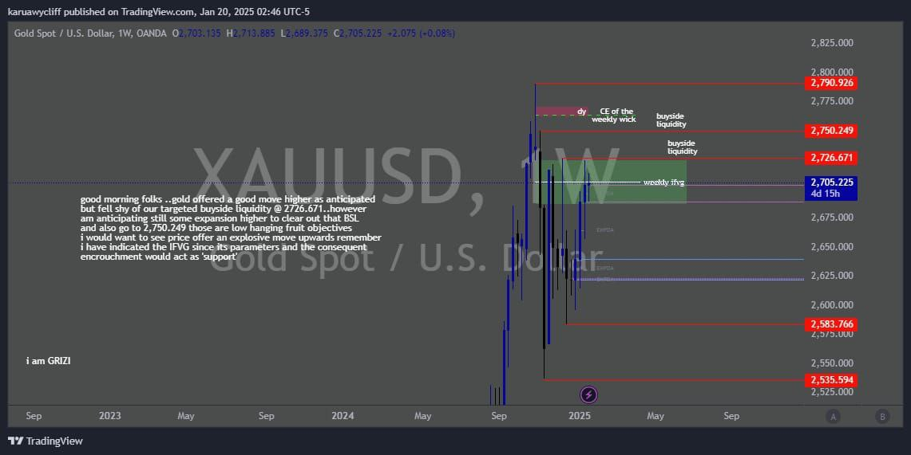

# INDICES

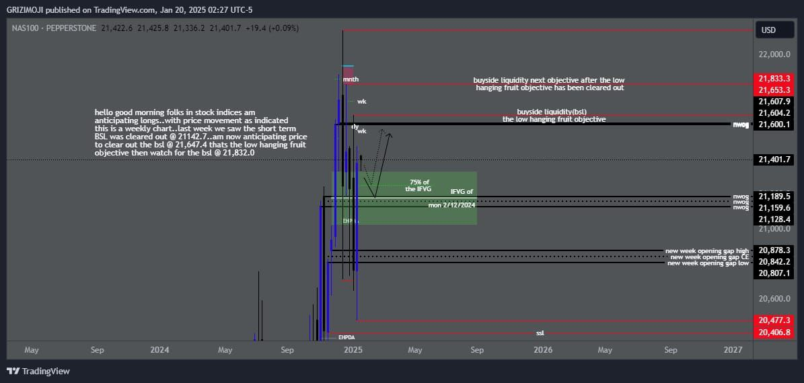
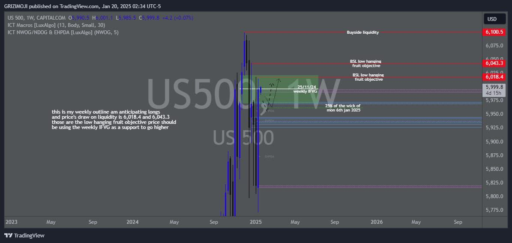

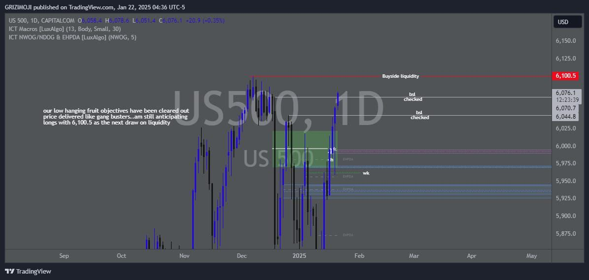


========================================================================================================================================================================================================================

# QUANT ENGINEER PROFESSIONAL

```
=> https://x.com/pyquantnews
=> https://www.pyquantnews.com/
```

 ----------------------------
 
```
=> PEPPERSTONE Broker
=> Interactive Broker
=> MyFXBook
=> DUKASCOPY-Swiss Banking Group
=> QUANT CONNECT - SECURE Data Centre for Quantitative Models [HIGH-PERFORMANT Telecommunication, Short HIGH-PERFORMANT Fibre Cable, SOLID INFORMATION, HIGH-PERFORMANT Quant Models, HIGH-PERFORMANT Hardware, (STABLE + HIGH-PERFORMANT + BACKUP) INTERNET && ELECTRICITY]
```

# LIGHT MANAGEMENT LTD

```
> DAWN LABS
> DAWN GROUP NGO
```

----

# INVESTMENT COMPANY/[INDIVIDUAL TRADER]

### 1 RISK DISCLOSURE AGREEMENT + COMPENSATION

```
>>> If Funds not used for Investment, its Illegal and MUST be FULLY COMPENSATED[INITIAL INVESTED CAPITAL]
>>> If Funds used for Investment, Investment company can decide not to compensate the clients and hence Ruin Investment company Reputation.
>>> If Funds used for Investment, Investment company can decide to PARTIALLY 1/8 compensate the clients under MEDIATION/ IN-HOUSE  DISCUSSIONS and hence Salvage Investment company Reputation. 
```

### 2 TAX MANAGEMENT 

```
>>> OFFSHORE ASSET MANAGEMENT ===> SEYCHELLES
> WITHHOLDING TAX
> CAPITAL  GAIN TAX
>>> FAMILY HOME COMPANY ===> KENYA
```
----

# QUANT GROUP CONSULTANCY COMPANY

OUTSOURCING INVESTMENT SERVICES [FINANCE] => 🧨 HENRIOT GROUP LTD FIRM - GAMMA DELTA FUND 🧨HAVE_CMA INVESTMENT_LICENSE🧨

CLIENT => 👉  QUANT GROUP CONSULTANCY 🧨NO_CMA_LICENSE && NO_INVESTMENT_LICENSE🧨
PUBLIC - GOVERNMENT =>  👉 LIGHT MANAGEMENT LTD 🧨HAVE_ MANAGEMENT && NGO _LICENSE🧨

```

Is your Capital working hard enough?

Data is the core of our alpha.
Our approach to Financial markets involves nothing more than simplicity & common sense!
It’s data – that powers each decision we make, positioning Henriot as a pioneer of the next generation of investment management. 

The pillars to our Investment Philosophy
Our investment philosophy seeks to enable the creation of holistic investment solutions for clients, via implementation of Key Pillars.
Volatility is Opportunity
Volatile markets occasionally offer extraordinary opportunities, and having cash allows us to take advantage of these. We see volatility as more of an opportunity rather than a risk
Rationality & Common sense goes a long way!
We believe the simpler the thesis, the better. We simply try to focus on finding big gaps between the current price and a conservative estimate of intrinsic value.
Time Arbitrage
The ability to invest on a longer time horizon than most other people is one of Henriot’s most important advantages.


Quantamental investing is Fast, Reliable, and Consistent.
Market Amplification
Market Amplification through Consistency, Discipline and Objectivity. Quantamental trading is characterized by its consistency, discipline, and objectivity.
Hunt for positive Alpha
Henriot achieves extensive diversification through various different financial instruments and applying multiple completely different trading strategies. Thousands of different strategy variations catch trends, react to market waves, find repetitive patterns and seasonalities.
Humans can distinguish alpha from Noise
Human intervention can effectively distinguish alpha from noise Machine learning and Algo trading models has the potential to help investors find alpha in unexpected places. In as much as we always aim to achieve 'no touch' of our models, we still  evaluate every trade placed. 

Dive into the new age of Quantamental Investing.
Our Solution
Long-biased Equity Investing
Henriot’s investment approach is meticulously crafted to identify and select assets with the highest potential for capital appreciation. Our proprietary algorithmic model, designed in-house, analyzes millions of data points monthly to pinpoint companies with a high probability score. This score encompasses a blend of critical metrics. 
Proprietary Research
Our Market Intelligence team conducts thorough fundamental research and integrates it with advanced machine learning methods, macroeconomic analysis, sell-side research, and quantitative approaches. This combination empowers our investment teams with unique insights and innovative products, helping them uncover potentially profitable alpha-generating opportunities.
Quant Modelling
By leveraging a unique set of data feeds and variables, our quantamental model ranks companies into scores, allowing us to systematically target investments that demonstrate robust fundamentals and strong market positioning.
Global Macro Investing
Our global macro business consists of portfolio team focused on generating uncorrelated returns. They achieve this through discretionary investments in developed and emerging markets across various asset classes.


---------------------------------------------------------------------------------------


No experience needed
Top up the account, join
"Gamma Delta Fund" and let us run the game.
Consistent Return
Target 8% yearly return based on initial deposit
```

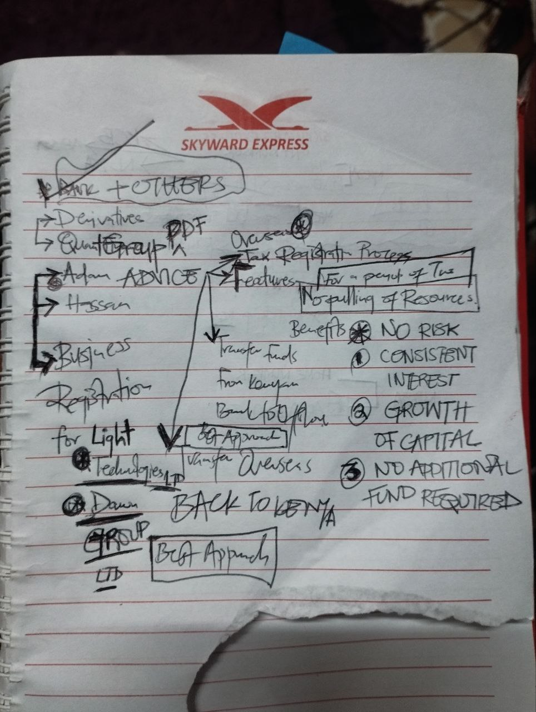

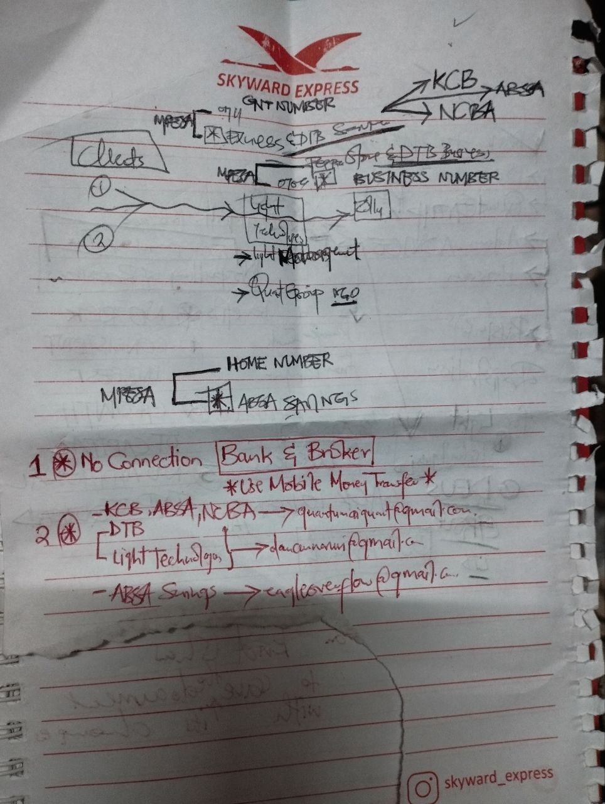

