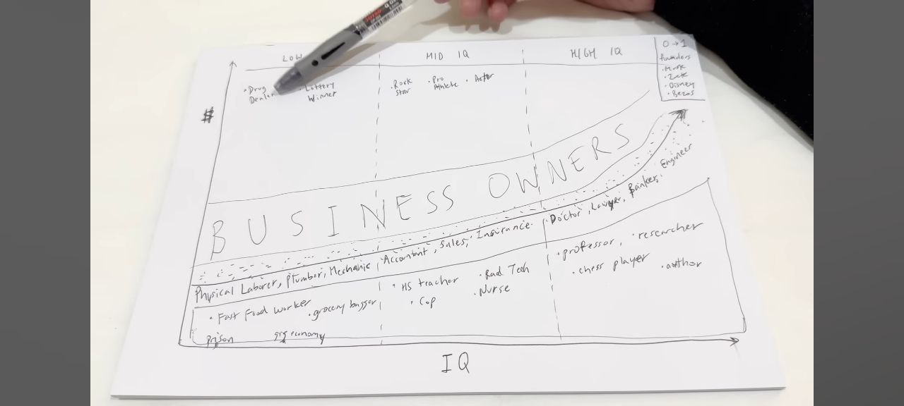
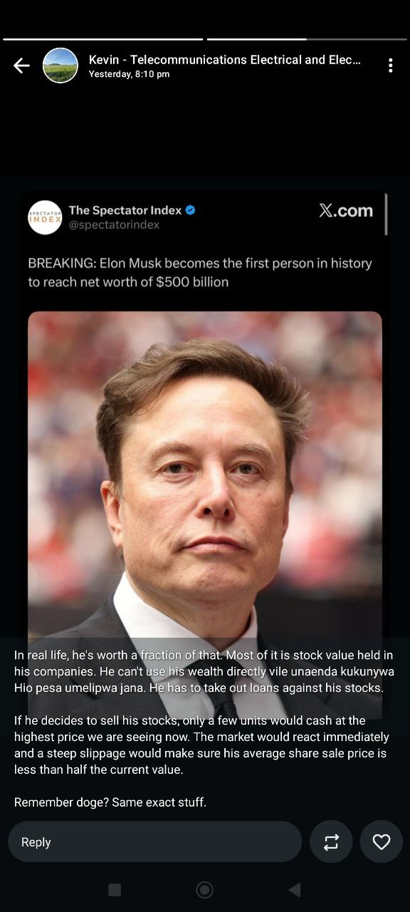
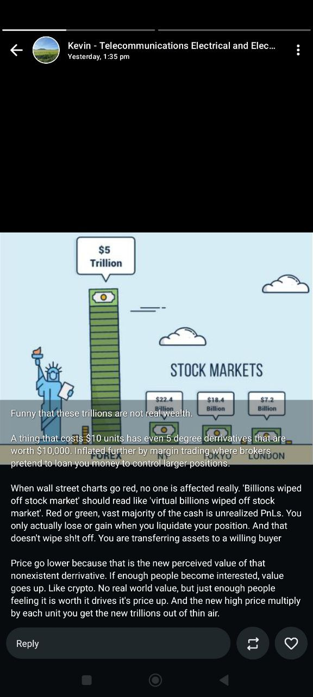
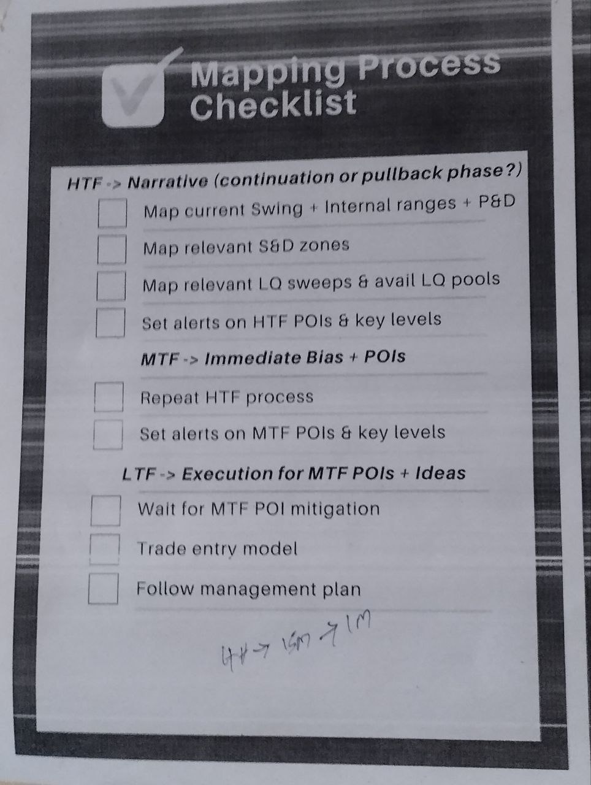
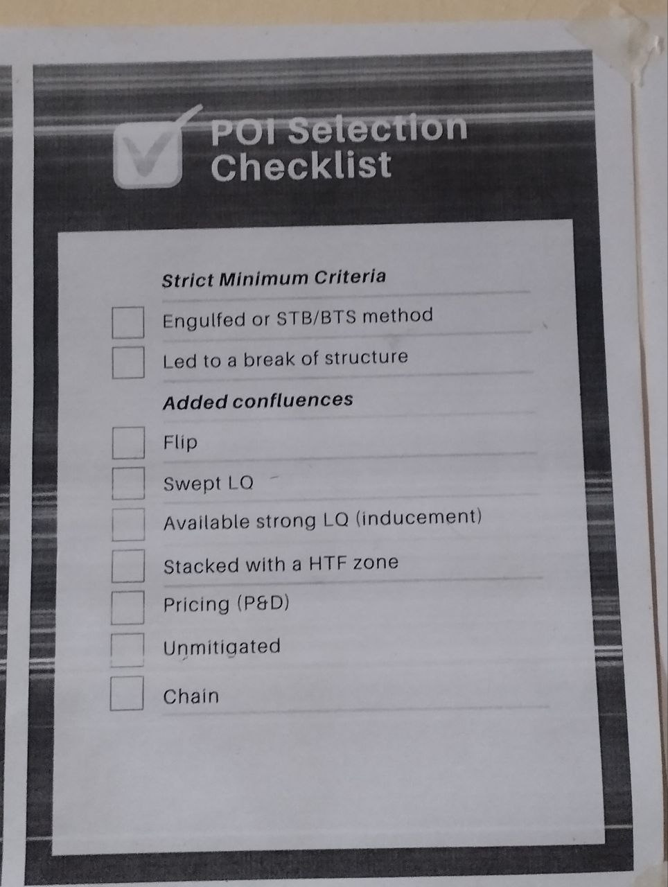
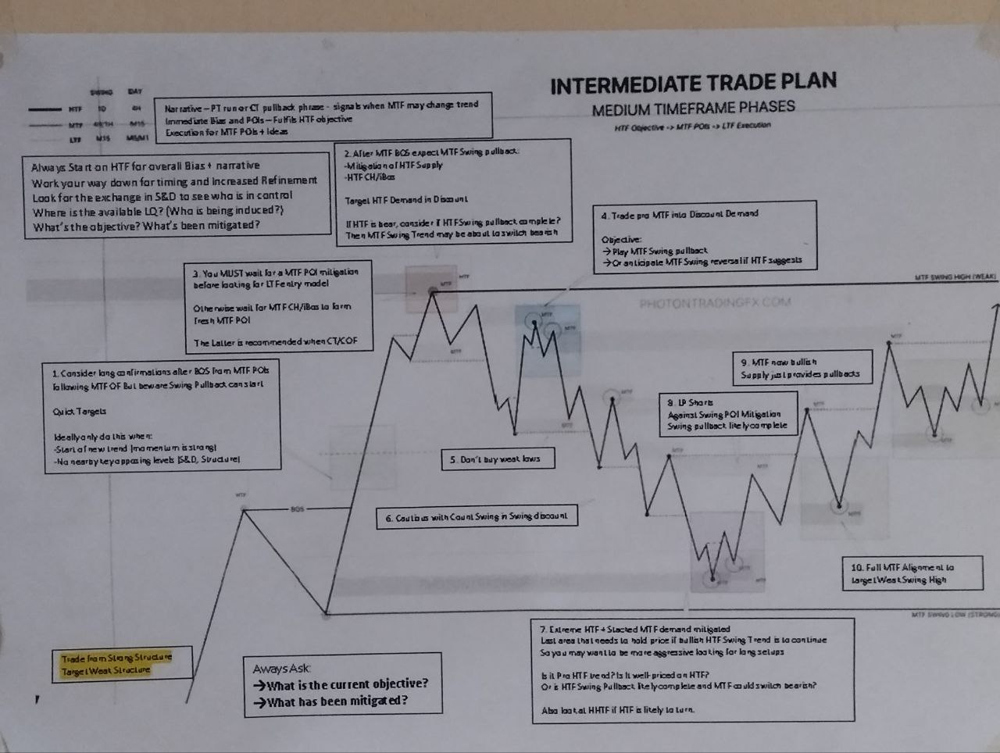
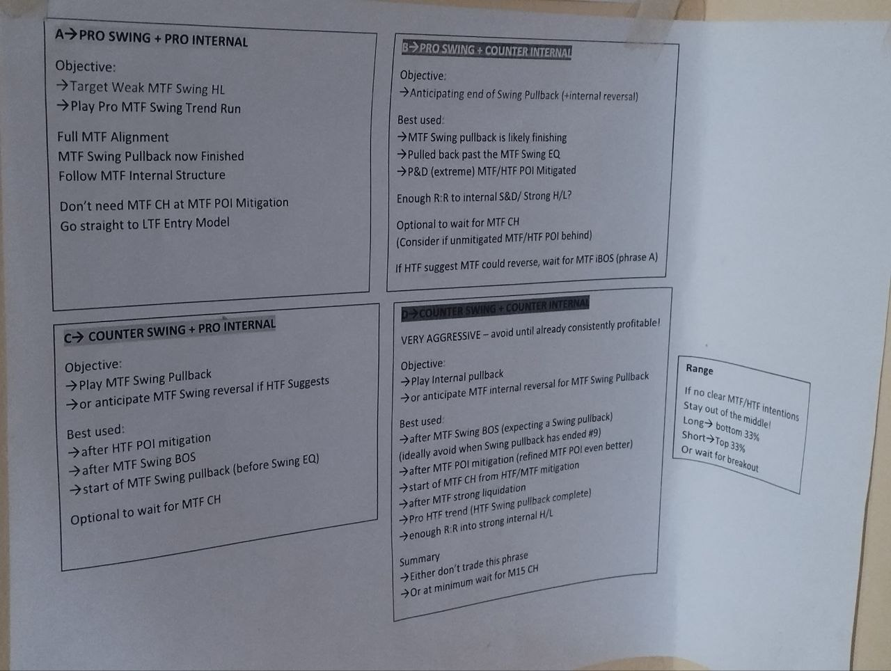
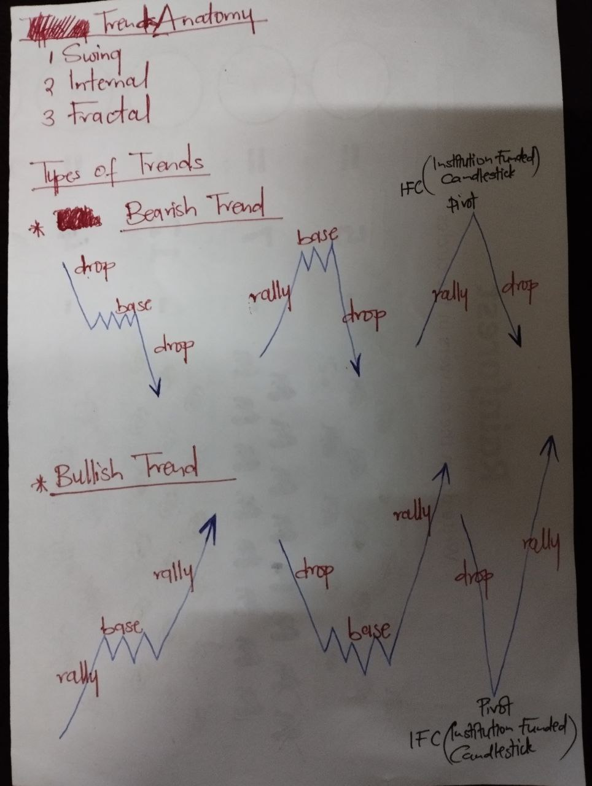
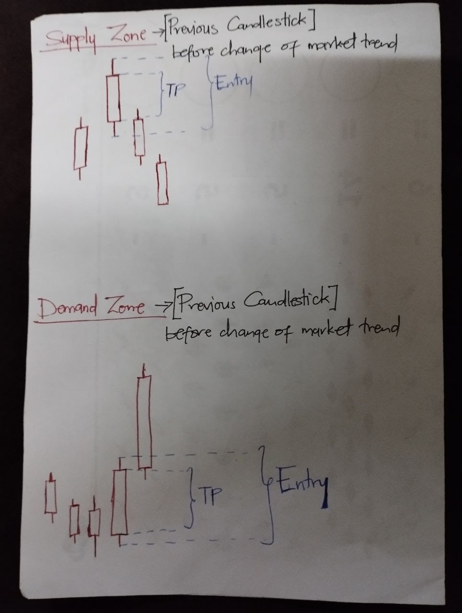

# * FINANCIAL ENGINEERING SCOPE

```
👉 A MUST

COMMUNICATION ===> YouTube
Detection System ===> Wazuh
Global Markets ===> FINANCIAL THEORY https://www.youtube.com/watch?v=HdHlfiOAJyE&list=PLUl4u3cNGP63B2lDhyKOsImI7FjCf6eDW
                    PHOTON TRADING
                    VECTOR SMC
                    ICT
------------------------------------------------------------------------------------------------------------------------------------------------------------
✅ DJANGO && FLASK
1. BOTH(CRASH + REST API)
2. CRUD ===> 4 PYTHON-C-BASH-APPLICATIONS
3. DJANGO HOSPITAL -> Github Repositories
-------------------------------------------------------
✅ DJANGO && FLASK API
4. FLASK CONSUMING OF API
   ---> FLASK API (Overview) -> https://github.com/devopsengineerDan/Daniel_news-highlight
   ---> FLASK  API (Detailed) -> https://github.com/devopsengineerDan/Daniel_personal-blog
5. FLASK CREATING OF API
   ---> Backend-blog-application-python-api -> https://github.com/devopsengineerDan/backend-blog-application-python-api?tab=readme-ov-file
   ---> Sendy S API Wrapper -> https://github.com/devopsengineerDan/python-wrapper-for-sendy-s-API
6. DJANGO API ===> 4 PYTHON-C-BASH-APPLICATIONS
✅ DATA PIPELINES
7. Fringe Recurrent Neural Network
8. ---> Data Pipelines 1 & 2
   ---> 

9.* => DATA PIPELINE
1)Python Data Cleaning        ===> https://github.com/devopsengineerDan/data-cleaning-python
2)Pyspark Tool                ===> https://github.com/devopsengineerDan/pyspark-ETL-project-and-airflow-Data-pipeline
3)ML Pipeline part 1 and 2    ===> https://devopsengineerdan.github.io/  My blog name devopsengineerdan which is dev Repository/alexloannides blog
4)Deploying ML Models with Bodywork   ===> https://devopsengineerdan.github.io/  My blog name devopsengineerdan which is dev Repository/alexloannides blog 
5)Deploying Python ML Models with Flask, Docker and Kubernetes    ===> https://devopsengineerdan.github.io/  My blog name devopsengineerdan which is dev Repository/alexloannides blog 

-----------------------------------------------------------------------------------------------------------------------------------------------------------------------------------------
✅ REAL PROJECTS
9.* PROJECTS
            ===> Email -> https://www.youtube.com/watch?v=xNqnHmXIuzU
            ===> News Letter -> https://youtu.be/hWtlskOaFNI?si=WNMXDlQ6sq1BTKM8
            ------------------------------------
            ===> INTERNET/NETWORK ENGINEER
            ===> LOANS
            ===> TRANSACTIONS
            ===> E-COMMERCE
            ------------------------------------
            ===> DETECTION
            ===> EMERGING DEVELOPMENT

========================================================================================
           
            ===>  Human Interaction computing
            ===>  Knowledge-based computing
            ---------------------------------------
            ===>  Business modelling computing
            ===> Computer reasoning (Software Engineering, AI and Quantum Computing)
            ---------------------------------------    
            ===>  [SECURE-CLEAN-SCALABLE-PERFORMANT] ERP SYSTEMS
```


```
👉 ROADMAP

FINANCE AND PORTFOLIO MANAGER
RISK AND COMPLIANCE MANAGER
ACCOUNT MANAGER

                                  FINANCE AND PORTFOLIO MANAGER
                                  RISK AND COMPLIANCE MANAGER
                                  ACCOUNT MANAGER
                                  -------------------------------
                                  CYBERSECURITY ENGINEER
                                  [Software Engineer]
                                  API ENGINEER
                                  AI/QUANTUM/DATA ENGINEER
                                  DEVOPS SYSTEMS ENGINEER
      ******************************************************************************
                                  ASSET MANAGER
                                  TAX MANAGER
                                  ACCOUNT MANAGER
```


# PROFESSIONAL PATHS





```
✅ KING(WEALTH&&LIFE) / DISTRIBUTED SYSTEM
✅ QUEEN(SILENCE&&NETWORK) / SECURITY
                                           ✅ BISHOP
                                     ✅ KNIGHT
                                           ✅ ROOK
                                           ✅ PAWN
```


# INVESTMENT PORTFOLIO

```
👉 ARTIFICIAL INTELLIGENCE
👉 BLOCKCHAIN
👉 ROBOTICS
👉 ENERGY STORAGE
👉 MULTIOMIC SEQUENCING -> LIFE SCIENCE
```


# MILITARY INDUSTRIAL COMPLEX

```
🧨 DEFENSE COMPANNIES
DEFENSE INDUSTRY ===> https://lockheedmartin.com/
CYBERSECURITY INDUSTRY --- RESEARCH ===> https://www.openanalysis.net/#oalabs
                       --- PRODUCTION ===> https://cure53.de/     
GENERAL-PURPOSE INDUSTRY ===> https://palantir.com
--------------------------------------------------------------------------------
CENTRAL BANK ===> FEDERAL BANK
GENERAL-PURPOSE BANK ===> ROTHCHILD BANKS
 -------------------------------------------------------------------------------
INSURANCE ===> BLACKSTONE
BROKERAGE INDUSTRY ===> PEPPERSTONE
HEDGE-FUND INDUSTRY ===> K-BIT(Cryptocurrency), HENRIOT(Currency)                    
```

----------------------------------------------------

```
🧨🧨🧨 WORK MANAGER

Exness ---> [Short-term]
Pepperstone <==> Copy Trading ---> [Mid-Term && Long-term]
BINANCE / BETTER ALTERNATIVE ---> Cryptocurency

Ingot
Henriot                                                             
```


```
                                                    🧨  INSURANCE [Government, Business, Health, Worker]
🧨 CENTRAL BANKS -> CONTROLLER

🧨 MARKET MAKERS -> Efficiency

                            🧨 BANKS -> Liquidity Provider
                                  -> Low Leverage[Low Returns, Low Risks] ---> DEALING LICENSE   

🧨 BROKERAGE FIRMS -> Connector ---> NON-DEALING LICENSE   

                            🧨 RETAIL INSTITUTIONS -> Hedge Funds
                                                -> High Leverage[High Returns, High Risks]  ---> NON-DEALING LICENSE


                                                    🧨  PENSION
```

----------------------------------------------------

```
🧨🧨🧨🧨🧨🧨🧨🧨🧨🧨🧨🧨🧨🧨🧨🧨🧨🧨🧨🧨🧨🧨🧨🧨🧨🧨🧨🧨

       👉👉👉👉👉 Asset Management && Tax-Compliance && Off-shore Wealth

       =====> WEAPONS + GOVERNMENT --------> POLITICS [KANU && MASON] Sheep VS Goats
       =====> BANK + LAW 
       =====> TECHNOLOGY FIRMS
       --------------------------------------------------------
       =====> INSURANCE 
       =====> ACTUARISTS/ANALYSTS [BROKERAGE + HEDGE FUNDS]
       =====> PENSION EMPLOYEE SAVINGS
       --------------------------------------------------------
       =====> [CHURCH + NGO] + [SPORT + ENTERTAINMENT]
       =====> EDUCATION
       --------------------------------------------------------
       =====> LAND + MINERALS

🧨🧨🧨🧨🧨🧨🧨🧨🧨🧨🧨🧨🧨🧨🧨🧨🧨🧨🧨🧨🧨🧨🧨🧨🧨🧨🧨🧨

==============================================================================================================================================
1. FINANCIAL Engineering                                                 DEFENSE  | ATTACK
2. CYBERSECURITY Engineering   🧨https://www.syntura.io/                 DEFENSE  | ATTACK
3. AI, QUANTUM, SOFTWARE Engineering                                     DEFENSE  | ATTACK
4. TELECOMMUNICATION & COMPUTER ELECTRONICS SYSTEMS Engineering          DEFENSE  | ATTACK
*******************************************************************************************
                                                          5 COMMUNICATION
                                                          6 DRIVING
                             8 PROPERTIES                                    
                             7 LAND  
                             9 MINERALS  
                     
  
                     
AMUNITION
GUITAR
CHESS                           GOLF
                    POOL&SWIMMING  
                                RUNNING,BASKETBALL,FOOTBALL,RUGBY
                                WATCH
                                GAMING
==============================================================================================================================================
```

----------------------------------------------------                    

```
🧨🧨🧨 OWNERSHIP

David ===> TRANSPORT
Dawn Labs <---> Samuel && Dominic && Kevin ===> TECHNOLOGY
Daniel ===> GOLF ACADEMIES

Farming + Lands => Light Group   
```


# EXCHANGE MARKET [STOCK, FOREX, CRYPTOCURRENCY]

## FINANCIAL INSTRUMENTS

```
✅ STOCK EXCHANGE

                                                             🧨🧨🧨 KENYA/AFRICA && CHINA, RUSSIA 🧨🧨🧨
                                                       ===================================================================
              STOCK =====> LONG-TERM PERIOD [5-10-25-100]YRS  🧨🧨🧨 USA && CHINA && KENYA GVT STOCKS🧨🧨🧨
                                                              🧨 =====>  ON INFORMATION OF COLLAPSE ON CRYPTOCURRENCY SELL ALL USA STOCKS
                                                             👉 INDEX FUND
                                                             👉 EXCHANGE TRADED FUND
                                                             👉 MUTUAL FUND
                                                       ===================================================================
              =====> MEDIUM-TERM PERIOD [MONTHS-5-10-25]YRS ---> ✅ CRYPTOCURRENCY EXCHANGE ===> BINANCE
                                                            🧨 =====>  HOLD + TRANSFER PROFITS ELSEWHERE
                                                            🧨 =====>  USE MARGIN when ACTIVELY TRADING && NO MARGIN when NOT ACTIVELY TRADING
                                                            🧨 =====>  ON INFORMATION OF COLLAPSE ON CRYPTOCURRENCY SELL ALL TOKENS
                                                                                                       (  1. Sui
                                                                                                          ---------------
                                                                                                          2. Bitcoin -> Secure
                                                                                                          3. Etherium -> Universal
                                                                                                          4. Solana -> Retail
                                                                                                        )
----> Offshore/ Offgrid LIQUID
----> (GOLD + MINERALS), ART, ASSETS 
----------------------------------------------------------------------------------                                                                                                                                                             
----> BANKS | GOVERNMENT | INSURANCE, RELIGION/SPORTS/ENTERTAINMENT, EDUCATION
----> ARMORY, MINERALS, TECHNOLOGY(SOFTWARE, HARDWARE)
----> PROPERTIES, LANDS, PLANTS, ANIMALS, WATER

=======================================================================================================================================================================

=====> SHORT-TERM PERIOD [1]DAY
       🧨🧨🧨 INDICES 🧨🧨🧨  ---> Medium Volatility
👉 ---> INDEX US100 / NDX100 / NASDAQ     -----> NAS100 US tech 100 INDEX CFD  -----> Pepperstone
👉 ---> INDEX US500 / S&P500 USA ECONOMY  -----> US500                         -----> Pepperstone

   
   >>> INDEX [US30, DJIA] ---> Highly Volatile

=======================================================================================================================================================================

✅ ACTUAL                  👉 STOCK
✅ FUTURE PRICE OF STOCK   👉 FUTURES                     ---> INDEX NDX100 / NASDAQ, S&P500 USA ECONOMY
✅ TOY                     👉 (EQUITY) <-> DERIVATIVES    ---> INDEX US30, US100, US500
✅ TOY                     👉 CFDS :Over the Counter

 
 >>> FUTURES ---> (NOT AN ACTUAL STOCK) (BASED ON AN ACTUAL ASSET/SECURITY) (CONTRACT BETWEEN TWO INVESTORS)
 >>> (EQUITY) <-> DERIVATIVES ---> (NOT AN ACTUAL STOCK) (BASED ON AN ACTUAL ASSET/SECURITY) (CONTRACT BETWEEN YOU AND BROKER)
 >>> CFDs ---> (NOT AN ACTUAL STOCK) (BASED ON AN ACTUAL ASSET/SECURITY) (CONTRACT BETWEEN YOU AND BROKER)
 >>> OPTIONS --->  ***** COMPLEX ***** (NOT AN ACTUAL STOCK) (BASED ON AN ACTUAL ASSET/SECURITY) (CONTRACT BETWEEN TWO INVESTORS) 
```

```
✅ FOREX EXCHANGE

=====> SHORT-TERM PERIOD [1]DAY
👉 ---> COMMODITIES
👉 ---> CURRENCIES
```


# EXCHANGE REGULATOR
 
```
Inter-Bank Money and Deposit Association (IBMDA) -> Regulate the Exchange Algorithm 
XTX Money -> Maker
Citi bank -> Dealers & Liquidity Provider
```


# SASRA SACCO REGULATOR

```
1. Data Protection
2. Rate Limit on API
3. Sanitization of data 
4. Validation of data
5. Secure Configurations
6. Access Control(User Roles)
7. Change Data Capture(LOGS)
```

# LOAN

```
👉 Lender MAIN Requirements
1 Lender Policies and Guidelines
2 Lender Advisor
3 Financial Advisor


👉 Borrower MAIN Requirements
1 Repayment Terms
2 Credit History
3 Financial Statements Balance Sheet [Income & Expenses] and Cash-flow Statement


👉 Application Requirements
1 Business details: Lenders will look for detailed information about the business, including its industry, history, management team, and financial performance. They will also want to understand the purpose of the loan and how it will be used by the business.
2 A business plan is required for businesses that are less than 3 years old
3 A marketing plan is required for businesses that are 3 years or older
4 Two years of financial statements and tax returns are required
5 Personal Financial Statements
6 A -> Collateral: Lenders may require collateral to secure the loan, such as real estate, equipment, or inventory. They will want to evaluate the value and quality of the collateral to determine the loan amount and terms. 
  B -> Personal guarantee: In some cases, lenders may require a personal guarantee from the business owners or other guarantors to secure the loan. This ensures that the loan will be repaid even if the business is unable to do so. 
7 Legal structure documents
8 Resumes or biographies
9 Credit Release Form
10 Other relevant materials


👉 How to address competition in a loan proposal?
1-> Market Analysis: Provide a detailed analysis of your industry and identify key competitors. Explain how your business differentiates itself from competitors and highlight your unique selling points.
2-> Competitive Advantage: Clearly articulate your competitive advantage and explain how it positions your business for success in the market.
3-> Marketing Strategy: Outline your marketing strategy and explain how you plan to attract and retain customers in the face of competition.
4-> Risk Mitigation: Address potential risks associated with competition and explain how you plan to mitigate these risks to ensure the success of your business.
5-> Growth Potential: Demonstrate the growth potential of your business and explain how you plan to capitalize on opportunities in the market to outperform competitors. 
```


# PROFESSIONALS

```
👉 PSYCHOLOGIST ===> [Breath + Environment Expert(INTELLIGENCE[Secret+Clandestine Gathering/Stealing+Conglomorate  || Knowledge+Innovation] + AWARENESS + IN HARMONY WITH NATURE Harmonious[Necessity]-Integrated[Choice/Want]-Industry[Need])]

👉 ALPHA {WEALTH/SECURITY ACCUMULATION && KINDNESS}
👉 MANAGER [Managing Director MD && General Manager]
👉 OPERATIONS MANAGER [Global Market Director && Manager]

👉 FINANCIAL ANALYST ===> [Chartered Financial Analyst + Portfolio Manager]
👉 🌀 RESEARCH ANALYST && OFFICER  🧨 INVESTMENT ANALYST && OFFICER [TRADER/ EXECUTION]
👉 RISK MANAGER <=> EQUITY MANAGER ===> [Risk Little To Acquire More AND NOT Risk More To Acquire Little] && [Hold on is a Strategy]

=================================================================================================================================================================================================

👉 FINANCIAL ENGINEER

1. Real-Time Portfolio Selection and Optimization: Enhance real-time portfolio optimization and capital allocation algorithms to maximize returns while managing risk.
2. Predictive Momentum Model: Implement and integrate a predictive momentum model into existing market-making and taking strategies.
3. Post-Trade Analysis: Develop and implement advanced post-trade analysis tools to evaluate strategy performance and identify areas for improvement.
------------------------------------------------------------------------------------------------------------------------------------------------------------------------------
1. Portfolio Selection and Optimization
2. Position Sizing
3. Market Timing
4. Risk Management

=================================================================================================================================================================================================

👉 PORTFOLIO MANAGER

Investment Banker ===> DEALING LICENSE
-------------------------------------------------------------------------------------
Broker [STOCK|EQUITY,DERIVATIVES|CFD's|FOREX|CRYPTOCURRENCY] ===> NON-DEALING LICENSE
-------------------------------------------------------------------------------------
Research <---> Market | Financial Analyst, Engineer
Asset Manager
#######################################################################################
🧨🧨🧨 NSE Nairobi Stock Exchange
🧨🧨🧨 Capital Markets Authority
```


#  33 MASTERY
 
```
 FINANCIAL MODELLING && DATA ANALYTICS && ENGINEERING && SCIENCE
```


# INTELLIGENCE AND AWARENESS

```
👉 *************** SECURITY AWARENESS *******************
KNOW   | 97% (STRATEGY + TACTIC)
RANGES | HEDGING + PREVAILING TREND

================================================================================

👉 GOLDEN RULES
Long-term ===> Acceptable Profit
Mid-term  ===> Acceptable Profit
Short-term  ===> Acceptable Profit
-------------------------------------------
===> DO NOT BE TOO GOOD --- Be Harmonious, Integrated, Industry
===> DO NOT BE A PSYCHOPATH
[Make Trade that you can explain] ===> STRATEGY, ENTRY, PLAYBOOK
[PUBLIC KNOWLEDGE: MARKET IS RANDOM: HENCE YOU ONLY ANTICIPATE]
===> Allow Minimum Loss

================================================================================

DEBT BUBBLE             <----------------------->    GOVERNMENT AID         
CASINO                  <----------------------->    BAIL OUT
COMPUTER DERIVATIVES    <----------------------->    QUANTITATIVE EASING

================================================================================

Investors played it safe with mutual funds or blue-chip stocks

✅ Got curious. ✅ He moved when others froze.
✅ Followed his own analysis. ✅ He trusted his process, not the market’s mood swings.
✅ Stayed grounded. ✅ He found hidden value through deep research.


Investors got it wrong: 
❌ Mistiming trades
❌ Paralyzed by fear
❌ Chasing hype


Most investors stay stuck in a cycle:
❌ Anxious they’ll screw it up and lose big.
❌ Overwhelmed by thousands of stocks.
❌ Frustrated by hours of research with no clear answers.

He bought great businesses, only when they were mispriced
Weschler didn’t just look for quality—he waited for the moment the market got it wrong.
✅  He sought out companies with high returns on capital, moats(competitive advantage), and consistent cash flows.
✅  But he never paid full price. A great business at a bad price is still a bad investment.
✅  He moved when everyone else was distracted—finding value before the market caught on.
```


```
✅ TIME
AM/PM | 24HRS
1  -> 13
2  -> 14
3  -> 15
4  -> 16
5  -> 17
6  -> 18
7  -> 19
8  -> 20
9  -> 21
10 -> 22
11 -> 23
12 -> 24

✅ PRICE
===> Price Level
===> Price Ranges ---> Consolidation
===> Price Expansion ---> Market Structure

✅ STYLE
===> Setup
===> Execution
===> Playbook

✅ [VALUE FOR TIME] PLAYBOOK
===> SCALPER TRADER
1:1000
100K
5 LOT
Less than 5 MIN
===> DAY TRADER
A) NORMAL
1:400
100=1M , 400=4M
5 LOT=1M , 10 LOT=5M
🧨 AVOID Fundamental in [10 Minutes Total Duration]
---------------------------------------------------
B) EPIC/EXTREME
1:100
100=1M
5 LOT
🧨 Have TAKE PROFIT TARGETS
```


```
**************************************************************************************************************
✅ ===> YOU CANNOT CHEAT THE GRIND ---> Must go through the process.
   - BET 97% 
   - The quieter you become, the more you are able to hear.
   - ALERTNESS + AWARENESS. Then BE PATIENT.

✅ ===> GAME IS GAME
   - COMPETITIVE GAME
   - DON'T BE KILLED
   - CONQUER

✅ ===> LIFE IS LIFE
   - FEEL ---> FAITH  🧨 WISDOM
   - KIND ---> CHANGE
   - HARMONY ---> FORGIVENESS  🧨 JUSTICE HAS NO MERCY
**************************************************************************************************************


-------------------------------------------------------------------------------------------------------------
✅ SENTIMENTAL ANALYSIS ---> AWARENESS / CANNOT CHEAT THE GRIND
✅ TECHNICAL ANALYSIS ---> ENTRY , TAKE PROFIT / EXIT, STOP LOSS
✅ FUNDAMENTAL ANALYSIS ---> VOLATILITY, LIQUIDITY, TREND


✅ SIMPLICITY
✅ FOCUS 
✅ MANAGE YOUR EMOTIONS [HAVE GUT FEELING]


✅ Bigger Trend ---> DIRECTION Then Small Trend ---> ENTRY
✅ [Price Action/Level + Intrinsic value], [Price Level + Technical Analysis], [Fundamentals Analysis]
✅ BET/Take Your Ego or What You Think Out of the Game, Price Level, Price Range
🧨🧨🧨 CONSOLIDATION  = COMMERCIAL BUSINESS[SPECULATION, INDECISION]
-------------------------------------------------------------------------------------------------------------


==============================================================================================================
🧨🧨🧨 STRONG 🧨🧨🧨 ===> SCARED MONEY MAKES NO MONEY[QUICK TAKING OF PROFIT & EXITING OF TRADE]
🧨 STRONG TAKE PROFIT && EXIT ON AN ORDER BLOCK 🧨
🧨 ---> ONCE I RECOGNIZE AN LOSS-ORIENTED TREND IN PRICE, EXIT TRADE.
   ---> ADAPT TO A PROFIT-ORIENTED TREND 🧨
🧨 REPEAT 🧨
++++++++++++++++++++++++++++++++++++++++++
✅ Where is PRICE HEADING TO 
✅ WANT && DO NOT NEED
✅ Trading is PERIODICAL
==============================================================================================================
```

---------------------------------------------------------

# INTEREST RATES

```
🌀 Bond Prices Vs Bond Yield | Inverse Relationship -> https://www.youtube.com/watch?v=n83xZUCbDAg
🌀 How does raising interest rates control inflation? -> https://www.youtube.com/watch?v=R8VBRCs2jTU
-------------------------------------------------------------------------------------------------------
🌀 Quantitative Tightening Explained (and What it Means for Markets)Quantitative Tightening Explained (and What it Means for Markets) -> https://www.youtube.com/watch?v=KTWVyFFpGXQ
🌀 What is Quantitative Easing? -> https://www.youtube.com/watch?v=llslyXPu6wI


🧨 ORDER OF MARKET TREND
✅ 1. Interest Rates
✅ 2. Amount of Buyers/Consumers and Sellers/Producers
✅ 3. Price Action
✅ 4. Therefore; Increase in interest rates increases Sellers in the market, making price to fall
                 Decrease in interest rates increases Buyers in the market, making price to rise
✅ 5. Hence; Relationship between Demand and Supply
```

```
🧨 When the economy is doing good, inflation increases, Central bank increases interest rates.
🧨 When the economy is doing bad, inflation decreases, Central bank decreases interest rates.

-------------------------------------------------------------------------------------------------------------------------------------------

✅ FINANCE SUSTAINABILITY OF A GOVERNMENT
Debt Interest                                     DEBT
-------------------------------------    =      -------------------------------
Inflation + Economic Growth                       GDP(Gross Domestic Product)


🧨 How the Government keeps Debt Low
1. Lower debt interest
2. Increase inflation + Increase economic growth
3. Increase tax + Lowering GVT development expenses
```

---------------------------------------------------------

## Bond Calculation

```
Bond Yield: It is measure return of a bond(%)

Bond Yield =  Bond Coupon    * 100 %
             -------------
              Bond Price

 PRICE          | COUPON             | YIELD (%)
----------------------------------------------------------
 $ 1000         | $ 50               | 5 %
 $ 900          | $ 50               | 5.5 %    
 $ 1100         | $ 50               | 4.5 % 

✅✅✅ Therefore; Increase in Interest Rates increases Sellers in the market, making Price to fall. Hence leading to increase in Yield.
                  Decrease in Interest Rates increases Buyers in the market, making Price to rise. Hence leading to decrease in Yield.
```

---------------------------------------------------------

## Compounding Calculation

```
👉👉👉 COMPOUNDING CALCULATOR ===> https://github.com/devopsengineerDan/compound-interest-calculator

👉👉👉 COMPOUNDING FORMULAE 
👉 Yearly Contribution Compounding
FV = PV (1 + R/F)^NF
Future Value = Present Value (1 + Rate/Frequency of compounding)^Number of years * Frequency of compounding
🧨 Frequency of compounding = Is Daily
Future Value = 500,000(1+0.12/365)^10*365
Future Value = 1,659,731

👉 Monthly Contribution Compounding
FV = A((1+r)^n -1)/r
A = 3,000
r = 12% which is 0.12 for one month is 1% which is 0.01
n = 10 yrs * 12 mths = 120 mths
Future Value = 3000((1+0.01)^120-1)/0.01
Future Value = 1,150,193

👉 Total
Total Future Value =  1,659,731 + 1,150,193
Total Future Value =  2.8 million

--------------------------------------------------------------------------------------------------------------------------------------------------------------------------------------

👉👉👉 POSITION SIZE CALCULATOR ===>  BABYPIPS 🧨 DETERMIONE LOT SIZE TO USE ===> https://www.youtube.com/watch?v=GvkmQVkXZRE


 Lot            | PS (Position Size)      | LPP (Loss Per Pip)
---------------------------------------------------------------
 Micro          | 1000 u                  | $ 0.10
 Mini           | 10,000 u                | $ 1.00    ===> $ 4
 Lot            | 100,000 u               | $ 10.00   ===> $ 11

PS (Position Size)
LPP (Loss Per Pip)
RT (Risk Tolerance)
SL Pips (Stop Loss Pips)
AB (Account Balance)

RT= AB * % of Acc to Risk
RT/SL Pips=LPP

Example 1:
RT = $ 12,252 * 0.03 = $ 367
SL Pips = 32
LPP = $ 11
-----------------------------------------------
Example 2:
RT = $ 10,000 * 0.01 = $ 100
SL Pips = 25
LPP = $ 4
````


# FINANCE  FUNDAMENTALS
 
```
 Finance and Investments
 Portfolio Management
 Advanced Portfolio Management
 Financial Statements Analysis
 * Fixed Income Investments Analysis
 * Alternative Investments Analysis
 Equity Investments Analysis
``` 
 
```
Professional Ethics and Governance
Regulation of Financial Markets
```

```
Public Finance and Taxation
Corporate Finance
Private Finance
```

```
 Financial Accounting
 Quantitative Analysis
 Econometrics
 Derivatives
```

----------------------------------------------------------------------------------------------

# QUANT FUNDAMENTALS


----------------------------------------------------------------------------------------------

# TRADING FUNDAMENTALS RESOURCES

```
=====> PSYCHOLOGIST 🌀 Dr. Steven Burger
=====> 🧨🧨🧨🧨🧨🧨 FinCrime Agent

🌀 David, BULL[When You See It Swing The Bat Hard]
🌀 Daniel
--------------------------------------------
🌀 Kevin
🌀 Photon Trading

🌀 SMB Capital

--------------------------------------------------------------------------------------------------------------------------------------------------------------------------------------------------------------------------------

STOCK EXCHANGE   
🌀 Howard Marks
🌀 Buffet -> Berkshire Hathawa

FOREX EXCHANGE                                                                                                                  
                                                   		   
🌀 Jim Simons -> Medallion Fund
🌀 Alex Gerko -> XTX

                                                                     
🧨 Quant Researcher, Quant Engineer, Quant Trader, Quant Portfolio Manager
🧨🧨🧨  Quant Engineer - LechGrzelak -> https://lechgrzelak.com/


🌀 Quant - Korean Yuppie -> https://www.youtube.com/watch?v=kFiiMymTtO0
🌀 Quant Books - QuantPy -> https://www.youtube.com/watch?v=ZSavDAaKy50
🌀 Quant Resources - Coding Jesus -> https://www.youtube.com/watch?v=cXNL4JKBL6w
```


```
✅ NETWORK
Gold ---> Dun Kiptoo SA Mechanical Engineer
Stock ---> Bill Michaels Nandwa => Tony => Adam
CryptoCurrency ---> Anthony => Marcus => Evan | => Jerry Bogonko JBO Instagram, Sam Telegram, Victor 
Alex Omollo => Kevin Telecommunications => Emmanuel Promota Click S.Sudan
```


# FINANCIAL ANALYST PROFESSIONAL

## FOREX COMPANIES
 
```
FUNDED NEXT
FUNDING TRADERS.COM
FUNDING PIPS


thelegendstrading.com
SMB Capital


XTX Markets
Renaissance Technologies
Henriot Group => Gamma Delta Fund
```


## STRATEGY SETTINGS


-----------------------------------------------------------------------------------------------

## PLATFORM SETTINGS

```
MT4 3b
Position Sizing + Lot Sizing Formulae ======> 4a
======> Trading Simulator 4a -> Search for Kion Hi 
======> Forex Position Sizing Calculator ---> Adam Khoo


======> Back Test -> Soft4FX, Deriv, GoChatting
======> Identify Strength of Currency -> FX Blue
======> 🧨 Dollar Index => USDX / DXY
======> NEWS -> Forex Factory(Adjust Time to My Local Time and Zone)


======> TRADING -> TradingView
1 GOLD
2 -> Stock
  -> EQUITY -> Derivatives, Options
  -> Currencies ,CFDs


======> Journaling -> [FREE]MyFXbook -> Search for PiranhaProfits Forex Trade Journal [PAID]Edgewonk, Trading Vault


========================================================================================


🧨 MT5 CHART CUSTOMIZATION

SCHEME :  Colour on white
BACKGROUND : Old Lace
FOREGROUND :  Black


========================================================================================


🧨 TRADING VIEW TOOLS

Rectangle
Path
Ellipse
Long Position
Short Position
Trend
Hoizontal Line 
Horizontal Ray
Price Range
```


# ELITE TRADING BEST PRACTICES


> ===> TRADE VIEW PLATFORM 

> HIGHLIGHT REEL

> EASY MONEY TRADE

> DAILY REPORT CARD TRADE

> DAILY TRADING JOURNAL

> DAILY PLAYBOOK  ===> Setup + Entry

-----------------------------------------------------------------------------------------------

### 1 TIME SESSIONS BEST PRACTICES


> 4AM

> 8AM - 10AM - 12PM - 1PM

>  3PM - 7PM - 9PM [- 11 PM on ELECTIONS] OR 15:00hrs - 18:00hrs - 21:00hrs [- 23:00hrs on ELECTIONS] 

-----------------------------------------------------------------------------------------------

### 2 TRADE BIAS AND TRADE ENTRY CHECKLIST BEST PRACTICES + FUNDAMENTALS


-----------------------------------------------------------------------------------------------

### 3 TRADE PLAN && TRADE RULES | EQUITY MANAGEMENT && RISK MANAGEMENT BEST PRACTICES

> INGOT BROKER

-----------------------------------------------------------------------------------------------

# DAWN STRATEGY BEST PRACTICES

```
🧨🧨🧨🧨🧨 TREND FOLLOWER  => STRATEGIC AND TACTIC
🧨🧨🧨🧨🧨 FINANCIAL INSTITUTION  &&  RETAIL INSTITUTION  👉 OrderBlock + Play Against The Masses 
🧨🧨🧨🧨🧨 GOAL =>
                     ✅ ✅ ✅ LIABLE/RESPONSIBLE for Risk
                     3 # Security Fund -----> SECURITIES[TO BE MINE + INVEST IN MORE ASSETS]
                     2 # Exchange Fund -----> SHOCK ABSORBER[CONTINUOUS TRADING + CASHFLOW]    
                     1 # Investor Fund -----> RISK FREE[RECREATE INVESTOR'S CAPITAL + AGREED PROFIT]
🧨🧨🧨🧨🧨 SECURITY
           INTELLIGENCE + INNOVATION
           [ORDAINED]
                                           [IN HARMONY WITH NATURE] 
                                           AWARENESS
                                           ATTITUDE
                   [CHOSEN]
                   CHARISMATIC
                   EMPATHETIC
                                           [ELECTED]
                                           SKILLS ===> Accurate, [Adapt, Synchronous], [Hardwork 97%]
                                           QUALIFICATIONS                 
```


```
🧨 SECURITY ===> INCREASE IN WEALTH
            ===> HARMONY WITH NATURE

                               🧨 BULL ===> SWING THE BAT
                                       ===> CAREFUL
                                                            🧨 AWARENESS ===> PRICE ---> Detailed
                                                                         ===> TREND ---> Bigger Picture
                                    🧨  DISCIPLINE
                                    > 7
                                    > 21
                                    > GOLDEN RULES
-----------------------------------------------------------------------------------------------------------------------------------------
   🧨🧨🧨 AVOID 1. Price Equilibrium WIDE Consolidation ---> 🧨CLOSE AT PROFIT🧨 , 2. Fundamental LONG Retracement ---> 🧨CLOSE AFTER OBSERVING THE CANDLE STICK🧨 , 3. Swing LONG Reversal <====>  FUNDAMENTAL BREAKOUT
   ✅ TRADE 1. BREAKOUT, 2. RETEST, 3. FUNDAMENTAL RETEST ***ONLY***
-----------------------------------------------------------------------------------------------------------------------------------------

                                                            🧨 PATIENCE ===> CONFIRMATION CANDLESTICK ---> Entry                 
                                                                        ===> TARGET ---> Exit  
```


```

                                                           ✅ AWARENESS
                                                           1. Swing the BAT
                                                           2. CAREFUL
                                                           3. TARGET
✅ TREND STRATEGY                                                                           ✅ PRICE STRATEGY
EMA [7,21]                                                                                  ICT => PD-Array  5AM [15MIN,30MIN,1HR]    
Price Action                                                                                SMC
---------------------------------------------------------------                             --------------------------------------------------------------- 
Rich Nick [DEMAND AND SUPPLY STRATEGY (ICT) 👉👉👉👉👉 CALCULATING TAKE PROFIT/TARGET]      Rich Nick  [DEMAND AND SUPPLY STRATEGY (ICT) 👉👉👉👉👉 CALCULATING TAKE PROFIT/TARGET]
Financial Institution + Retail  Institution 👉 OrderBlock + Play Against The Masses         Financial Institution + Retail  Institution  👉 OrderBlock + Play Against The Masses 
Fundamental                                                                                 Fundamental

```


```
            💡 STUDY 
💡 RESEACH         💡 DEMO TRADE    <===>     💡 ACTUAL TRADE
```


```
* FBS 1:1000 For VERY Short Duration Trade ===> XAU/USD && PRICE EMPHASIS STRATEGY
-----------------------------------------------------------------------------------------------
1 LARGE CASH For Long Duration Trade ===> XAU/USD && TREND EMPHASIS STRATEGY
2 GOD'S GRACE For Short and Long Duration Trade ===> XAU/USD && PRICE AND TREND EMPHASIS STRATEGY
3 SMALL CASH For Short Duration Trade ===> XAU/USD && Price  EMPHASIS STRATEGY
```


```
✅ ✅ ✅ CONSISTENCY | DISCIPLINE | PATIENCE ✅ ✅ ✅ 
✅ ✅ ✅ Lot Sizing Tips (FUND / MONEY / ASSET MANAGEMENT) Credit: Nick Analogy ✅ ✅ ✅

--------------------------------------------------------------------------------
* LARGE CASH FBS 1:1000 For VERY Short Duration Trade ===> XAU/USD && PRICE EMPHASIS STRATEGY
>>>>>>>>>>>>>>>>>>>>   Ksh. 200,000 = 5 LOT   <<<<<<<<<<<<<<<<<<<<<<<<<<
>>>>>>>>>>>>>>>>>>>>  pep 1:1000  <<<<<<<<<<<<<<<<<<<<<<<<<<
--------------------------------------------------------------------------------
1 LARGE CASH For Long Duration Trade ===> TREND EMPHASIS STRATEGY
>>>>>>>>>>>>>>>>>>>>   Ksh. 1M = 5 LOT   <<<<<<<<<<<<<<<<<<<<<<<<<<
>>>>>>>>>>>>>>>>>>>>  pep 1:400  <<<<<<<<<<<<<<<<<<<<<<<<<<
>>>>>>>>>>>>>>>>>>>>  ex 1:300  <<<<<<<<<<<<<<<<<<<<<<<<<<
--------------------------------------------------------------------------------
2 GOD'S GRACE For Short and Long Duration Trade ===> PRICE AND TREND EMPHASIS STRATEGY
>>>>>>>>>>>>>>>>>>>>   Ksh. 200,000 = 5 LOT   <<<<<<<<<<<<<<<<<<<<<<<<<<
>>>>>>>>>>>>>>>>>>>>  pep 1:200  <<<<<<<<<<<<<<<<<<<<<<<<<<
>>>>>>>>>>>>>>>>>>>>  ex 1:100  <<<<<<<<<<<<<<<<<<<<<<<<<<
--------------------------------------------------------------------------------
3 SMALL CASH For Short Duration Trade ===> Price  EMPHASIS STRATEGY
>>>>>>>>>>>>>>>>>>>>   Ksh. 50,000 = 2 LOT   <<<<<<<<<<<<<<<<<<<<<<<<<<
>>>>>>>>>>>>>>>>>>>>  pep 1:100  <<<<<<<<<<<<<<<<<<<<<<<<<<
>>>>>>>>>>>>>>>>>>>>  ex 1:100  <<<<<<<<<<<<<<<<<<<<<<<<<<
--------------------------------------------------------------------------------

```

---------------------------------

```
50 usd :-
High risk = 0.10 lot
Mid risk = 0.05 lot
Low risk = 0.01 lot

100 usd :-
High risk = 0.20 lot
Mid risk = 0.10 lot
Low risk = 0.01 lot

200 usd :-
High risk = 0.40 lot
Mid risk = 0.20 lot
Low risk = 0.02 lot

500 usd :- 
High risk = 1.00 lot
Mid risk = 0.50 lot
Low risk = 0.05 lot

1000 usd :-
High risk = 2.00 lot
Mid risk = 1.00 lot
Low risk = 0.10 lot

If you have an amount that is different from the amount above. Take the amount that is closest to the amount above and try to calculate.
```


```
 NEWS ANALYSIS


💡 **Notion Tip:** Create a new page and select `Daily entry` ****from the list of template options to automatically generate the format below every day


✅ ✅ ✅ NFP (non Farm Payroll)- non farm professionals ✅ ✅ ✅

-we avoid trading a day prior it because there is a cloud in price that prevents clarity in price and demanding that high level of degree of clarity would be a mayhem

-in NFP price tends to attack the nearest liquidity pool and if prior the release of the news there was that Orderflow in price nfp may tend to break that monotony not all the times but most of the times 

-and here price respects HTF PD arrays not with the highest degree of precision but price may overshoot it with some few handles 


✅ ✅ ✅ FOMC & FEDERAL FUND RATE ✅ ✅ ✅

-It is normally released at 2pm ET 

-if there are no news in the morning session its advisable to avoid trading the morning session prior fomc but if there is some clarity in price you can execute on the trade and be out of the market place before 10:30 go for the low hanging fruit objective

-in this price respects HTF OF  with that high degree of precision and our main target is the low hanging fruit objective dont be overzealous 

-when feds are speaking price does not reprice as a result of price reacting to what they have said but their words are just utilized  as a smoke screen to make price vulgar by the market makers

-we trade at the last hour macro because price may trade softer


✅ ✅ ✅ CPI NUMBER ✅ ✅ ✅

This is a straight bullet where liquidity is purged..it necessarily does not have to be that macro other macros can also be incorporated of the other news.. this is just what is normally anticipated for price to do.. its not the beyond end all panacea
```


```
🧨🧨🧨🧨🧨🧨🧨🧨🧨🧨🧨🧨🧨🧨🧨🧨🧨🧨🧨🧨🧨🧨🧨🧨🧨🧨🧨🧨🧨🧨🧨🧨🧨🧨🧨🧨🧨🧨🧨🧨🧨🧨🧨🧨🧨🧨🧨🧨🧨🧨🧨🧨🧨🧨🧨🧨🧨🧨🧨🧨🧨🧨🧨🧨🧨

>>> TRADING VIEW TOOLS
Indicators [EMA] 7 && 21
FluidTrades - SMC Lite
Fibonnacci


=======================================================================================================================================


👉 ****FOREX BACKUP*****
👉 ****INGOT BROKER NOTES*****
👉 ****HFM BROKER NOTES*****
👉 ****PHOTON TRADING NOTES*****
👉 ****KEVIN SUMMARY NOTES*****


🧨🧨🧨 SMART [Specific|Measurable|Achievable|Realistic|Time Bound] 🧨🧨🧨

---------------------------------------------------------

🧨🧨🧨 BEST <---> MARKETABLE <---> IRREPLACABLE 🧨🧨🧨

---------------------------------------------------------

🧨🧨🧨 RESPECT LAWS + MANAGE RESOURCES + RISK MANAGEMENT 🧨🧨🧨


=======================================================================================================================================


🧨🧨🧨🧨🧨🧨🧨🧨🧨 GOLDEN TRADING RULES 🧨🧨🧨🧨🧨🧨🧨🧨🧨
🧨🧨🧨🧨🧨🧨🧨🧨🧨 OPPOSITE IS TRUE AND RESULTS TO A LOSS WHEN PLACING TRADES 🧨🧨🧨🧨🧨🧨🧨🧨🧨

1 Subscribe to an A Booking Broker ===> OPPOSITE is a B Booking Broker 
2 ===> PSYCHOLOGY ===> Large Deposit, Large Lot size, Large Leverage | Small Deposit, Small Lot size, Small Leverage
3 Always use Trailing Take Profit and Stop Loss(Modify Take Profit and Stop Loss)

-----------------------------------------------------------------------------------------------------------------------------------------
******🧨 FX BLUE ==> AWARE of BASE CURRENCY STRENGTH [USD] 🧨******
******🧨 FOREX FACTORY https://www.forexfactory.com/ ==> AWARE of FUNDAMENTALS [Economic News, Fed Speech, Politics, Natural Calamities] 🧨******
******🧨 NOT EVERY DAY IS A TRADING DAY, YOU DON'T HAVE TO PLACE A TRADE, HENCE SAVE MONEY IN YOUR ACCOUNT <-----> ONLY PLACE QUALITY TRADES 🧨******


👉👉👉👉👉👉👉👉👉👉👉👉👉 🧨🧨🧨 RESOURCE MANAGEMENT + TRADING EDGE ONLY PLACE QUALITY TRADES  && A + TRADES 🧨🧨🧨

👉👉👉👉👉👉👉👉👉👉👉👉👉 🧨🧨🧨 ONLY Trade CANDLESTICK + TRADE ON LARGE SCREEN + CANDLESTICK TIME PERIOD 🧨🧨🧨

   🧨 15 MIN [FIRST 5 MIN => OBSERVATION] [10 MIN => ACTUAL TRADE]
   🧨 First Three Candlesticks -> High Probability Trades | High Profit| Low Risk
   🧨 AFTER First Three Candlesticks -> Less Probability Trades | Low Profit| High Risk

   ✅ TRADE ON TWO FULL SCREEN -----> PRICE EMPHASIS -----> TREND EMPHASIS
   ✅ REQUIRES FULL ATTENTION
   ✅ BODY TELLS THE STORY, WICK TELLS THE DESTRUCTION

   ✅ TRADE AS    👉 -----> SMART MONEY INSTITUTIONS TRADER
                  👉 -----> RETAIL TRADER
-----------------------------------------------------------------------------------------------------------------------------------------
   ✅ 🌀 DAY TRADER => HAVE [TARGET + ORIGIN PRICE] && TRUST YOUR STRATEGY 🌀 MEDIUM SCALE TRADE  🌀 LARGE SCALE TRADE
   ✅ 0.5 VERY LONG TRADES [VERY LARGE SCALE] 
   ✅ 1.0 LONG TRADES ===> RETEST / PULLBACK [MEDIUM & LARGE SCALE]
   ✅ CLOSE TRADES AT 1PM
   ✅ THEN TRADE BREAKOUT && RETEST / PULLBACK

-----------------------------------------------------------------------------------------------------------------------------------------
   🧨🧨🧨 AVOID 1. Price Equilibrium WIDE Consolidation ---> 🧨CLOSE AT PROFIT🧨 , 2. NEWS/Fundamental LONG Retracement ---> 🧨CLOSE AFTER OBSERVING THE CANDLE STICK🧨 , 3. Swing LONG Reversal <====>  FUNDAMENTAL BREAKOUT
   ✅ TRADE 1. BREAKOUT, 2. RETEST, 3. FUNDAMENTAL RETEST ***ONLY***
-----------------------------------------------------------------------------------------------------------------------------------------
   ✅ LOT SIZE/ CONTRACT SIZE
   1 TOTAL VOLUME LOT SIZE
   2 NUMBER OF ORDERS PLACED && 🧨EQUIVALENT TO FUNDS IN YOUR ACCOUNT🧨
   3 MARGIN RATIO && 🧨ALLOWANCE🧨 IN NUMBER OF ORDERS PLACED CREATING ROOM FOR RETRACEMENT    ------> PEPPERSTONE 1:300
                                                                                               ------> EXNESS 1:200
-----------------------------------------------------------------------------------------------------------------------------------------


+++++++++++++++++++++++++++++++++++++++++++++++++++++++++++++++++++++++++++++++++++++++++++++++++++++++++++++++++++++++++++++++++++++++++++++++++++++++++++++++++++++++++++++++++++++++++++++++++++++++++++++++++++++++++++


-------------------------------------------------------------------------------------------------------------------------------
******🧨 DO NOT EXCHANGE MONEY WITH LIQUID PROVIDER, ONCE PRICE HAS REACHED HIGHEST POINT,  EXIT TRADE 🧨******
******🧨 DO NOT TRADE RESISTANCE, SUPPORT🧨******
******🧨 DO NOT TRADE ORDER BLOCK && PRICE EQUILIBRIUM 🧨******
******🧨 DO NOT TRADE STOP LOSS HUNT[BUY, SELL, BUY STOP, SELL STOP], LIQUIDITY SWEEP For Example: HIGHEST POINT => BEAR TRAP OR LOWEST POINT => BULL TRAP 🧨******
******🧨 9. AVOID THESE CANDLESTICKS 🧨******
   ====> DO NOT Trade small wick and small body
   ====> DO NOT Trade very large wick on both sides and small body
   ^^^^^^^^^^^^^^^^^^^^^^^^^^^^^^^^^^^^^^^^^^^^^^^^
   ====> DO NOT Trade CONSOLIDATION small wick and small body
   ====> DO NOT Trade Doji Candlestick / Indecision / Equal Sellers and Buyers Volumes
-------------------------------------------------------------------------------------------------------------------------------

🧨 FUNDAMENTAL ====> 2 MINUTES FOR ENTRY, CHECK ANALYSIS ON 15 MINUTES, FOREX FACTORY *** REFRESH ***  1 MIN AND 30 SECONDS 🧨
🧨 % FOR SPIKE == WICK, K FOR MOVEMENT == BODY 🧨
🧨 PLACE TRADE WHEN  BODY IS FORMED 🧨
========================================================
🧨 NORMAL DAY  ====> 15 MINUTES FOR ENTRY, CHECK ANALYSIS ON 4HR, 1HR, 1DY, 1WK, 1MTH 🧨
========================================================
Higher Time Frame    Lower Time Frame
	W		H4
	D		H1
	H4		M15
	H1		M5
	M15		M1
-------------------------------------------------------------------------------------------------------------------------------
4. Trade after a FUNDAMENTAL.
5. Trade what you see not what you think.
6. Trade in harmony with the Trend not AGAINST.
7. Be PATIENT with the trading market then PLACE YOUR TRADE
8. Trade AFTER a CONFIRMATION CANDLESTICK

🧨 9. TRADE SETUP + ENTRY + [NOT EVERY DAY IS A TRADING DAY]

------------------------------------------------------------------------------------------------------------------------------------------------------------------------------------------------------


%%%%%%%%%%%%%%%%%%%%%%%%%%%%%%%%%%%%%%%%%%%%%%%%%%%%%%%%%%%%%%%%%%%%%%%%%%%%%%%%%%%%%%%%%%%%%%%%%%%%%%%%%%%%%%%%%%%%%%%%%%%%%%%%%%%%%%%%%%%%%%%%%%%%%%%%%%%%%%%%%%%%%%%%%%%%%%%%%%%%%%%%%%%%%%%%%%%%%%%%%%%%%%%%%%%%%%%%%%%%%%%%%%%%%%%%%%%%%%


-------------------------------------------------------------------------------------------------------------------------------
   🧨 LOT SIZE

👉👉👉 15 MIN TIME-FRAME

   👉 0.1 and 0.2 => SMALL momentum/displacement 
   👉 0.5 => MEDIUM momentum/displacement
========================================================================== 
   👉 1.0 => HIGH momentum/displacement => FUNDAMENTAL ===> M CAPITAL

*******************************************************************************************************************************
👉👉👉 1 MIN TIME-FRAME
    
   👉 🧨2.5 OR 3.0 => HIGH momentum/displacement => FUNDAMENTAL ===> B CAPITAL - 🧨1 MIN TIME-FRAME🧨
   👉 🧨4.5 OR 5.0 => HIGH momentum/displacement => FUNDAMENTAL ===> T CAPITAL - 🧨1 MIN TIME-FRAME🧨


   
   👉👉👉 🧨 TIME-FRAME [15 MINUTES] ELECTIONS[POLITICS] FUNDAMENTAL
   => 0.5 10MIN->5MIN
   => AIM for Specific Target Price AND / OR Order Block
==========================================================================
   🌀 SCALPER => DON'T EXCHANGE MONEY WITH LIQUIDITY PROVIDER / MARKET MAKER 🌀 SMALL SCALE 🌀
   ✅ 1.0 LONG TRADES ===> RETEST / PULLBACK [SMALL SCALE]
   => 1.0 13MIN -10MIN and @@@@@@@@@@@@ Guided by PREVIOUS CANDLESTICK + 10MIN->0MIN->PD ARRAY / Target Price @@@@@@@@@@@@
   => AIM for Specific Target Price AND / OR Order Block


   
   🧨 TIME-FRAME [15 MINUTES]  🧨SMALL+EASY MONEY🧨
   => 0.5 13MIN->10MIN
   => AIM for Specific Target Price AND / OR Order Block
========================================================================== 
   => 🧨1.0 13MIN->10MIN [INVERTED HAMMER / SHOOTING HAMMER]
   => AIM for Specific Target Price AND / OR Order Block


%%%%%%%%%%%%%%%%%%%%%%%%%%%%%%%%%%%%%%%%%%%%%%%%%%%%%%%%%%%%%%%%%%%%%%%%%%
 🧨🧨🧨AVOID🧨🧨🧨 1 MIN TIME-FRAME FUNDAMENTAL 🧨BREAKOUT🧨
   => 1.0 
   => AIM for Specific END OF I MIN
==========================================================================
   🌀 SCALPER => DON'T EXCHANGE MONEY WITH LIQUIDITY PROVIDER / MARKET MAKER 🌀 SMALL SCALE 🌀
   ✅ 1.0 LONG TRADES ===> RETEST / PULLBACK [SMALL SCALE]
👉👉👉 AFTER FUNDAMENTAL 🧨PULLBACK / RETEST🧨
   => 1.0 13MIN -10MIN and @@@@@@@@@@@@ Guided by PREVIOUS CANDLESTICK + 10MIN-5MIN-PD ARRAY / Target Price @@@@@@@@@@@@
   => AIM for Specific Target Price AND / OR Order Block
%%%%%%%%%%%%%%%%%%%%%%%%%%%%%%%%%%%%%%%%%%%%%%%%%%%%%%%%%%%%%%%%%%%%%%%%%%


   🧨 CANDLESTICK OBSERVATION
   WHY  => Candlestick Duration / Time Period To Form 
       👉 Less Time To Form => LARGE Candlestick
       👉 More Time To Form => SMALL Candlestick
   HOW  => Candlestick Behaviour => IMPULSIVE or NOT
   WHAT => Candlestick Previous Patterns
       👉 BODY tells Story and WICK tells Destruction

   🧨 ORDER BLOCK OBSERVATION
       👉 1 Resistance
       👉 2 Price Equilibrium / Fibonacci
       👉 3 Support


-------------------------------------------------------------------------------------------------------------------------------


👉 Trade Setup
👉 Trade Timing
👉 Trade Style
👉 Trade Structure ===> Entry and Exit
👉 BULL ===> [When You See It Swing The Bat Hard]


👉 MANAGE YOUR RESOURCES
👉 RISK MANAGEMENT

------------------------------------------------------------------------------------------------------------------------------------------------------------------------------------------------------

👉👉👉👉👉👉👉👉👉👉👉👉👉 🧨🧨🧨 RESOURCE MANAGEMENT + RISK MANAGEMENT 🧨🧨🧨

✅ ✅ ✅  ELECTIONS ✅ ✅ ✅
👉 [ 1 LOT ] BULL ===> Multiple Orders                      👉 STOP LOSS + 10 PIPS [ No TP + CLOSE ALL TRADES ] A* TRADE

    
🧨🧨🧨🧨🧨🧨🧨🧨🧨🧨🧨🧨🧨🧨🧨🧨🧨🧨🧨🧨🧨🧨🧨🧨🧨🧨🧨🧨🧨🧨🧨🧨🧨🧨🧨🧨🧨🧨🧨🧨🧨🧨🧨🧨🧨🧨🧨🧨🧨🧨🧨🧨🧨🧨🧨🧨🧨🧨🧨🧨🧨🧨🧨🧨🧨
```


========================================================================================================================================================================================================================

# XAU/USD EMPHASIS

### 1ST -> PRICE STRATEGY

```
🧨 >>> ORIGINAL PRICE
🧨 >>> TARGET PRICE
```

### 2ND -> TIME STRATEGY

```
🧨🧨🧨 5AM 15MIN  CANDLESTICK / PD-ARRAY => OBEYS [BUY-SIDE/SELL-SIDE LIQUIDITY] + [PREMIUM/DISCOUNT PRICE LEVEL]
🧨🧨🧨 5AM 30MIN  CANDLESTICK / PD-ARRAY => OBEYS [BUY-SIDE/SELL-SIDE LIQUIDITY] + [PREMIUM/DISCOUNT PRICE LEVEL]
🧨🧨🧨 5AM 1HR  CANDLESTICK / PD-ARRAY => OBEYS [BUY-SIDE/SELL-SIDE LIQUIDITY] + [PREMIUM/DISCOUNT PRICE LEVEL]

🧨🧨🧨 ✅ INDECISION CANDLESTICK / PROPULSION PD-ARRAY
🧨🧨🧨 ✅ PREMIUM PRICE AND DISCOUNT PRICE
```

### 3RD -> EMA STRATEGY + GOLDEN RULES

```
> 7
> 21
> GOLDEN RULES
-----------------------------------------------------------------------------------------------------------------------------------------
   🧨🧨🧨 AVOID 1. Price Equilibrium WIDE Consolidation ---> 🧨CLOSE AT PROFIT🧨 , 2. Fundamental LONG Retracement ---> 🧨CLOSE AFTER OBSERVING THE CANDLE STICK🧨 , 3. Swing LONG Reversal <====>  FUNDAMENTAL BREAKOUT
   ✅ TRADE 1. BREAKOUT, 2. RETEST, 3. FUNDAMENTAL RETEST ***ONLY***
-----------------------------------------------------------------------------------------------------------------------------------------
```

### 4TH -> FIBONACCI STRATEGY

```
> ALL HFM BROKER FIBONACCI STRATEGIES 
```

# TREND EMPHASIS

### 1ST -> SMC STRATEGY

```
> SMART MONEY CONCEPT (SMC) STRATEGY 

> [XAU/USD 3AM TIME + TIME-ZONE] BASED LIQUIDITY (TBL) STRATEGY 

> Buy-Side Liquidity STRATEGY ==> BUY-STOP LOSS  HUNT

> Sell-Side Liquidity STRATEGY ==> SELL-STOP LOSS  HUNT

> SWING HIGH STRATEGY ---> PREMIUM PRICE

> SWING LOW STRATEGY ---> DISCOUNT PRICE

> PRICE EQUILIBRIUM
```

### 2ND -> DEMAND AND SUPPLY STRATEGY (ICT) 👉👉👉👉👉 CALCULATING TAKE PROFIT/TARGET

```
> PRICE ACTION BASED ON MARKET STRUCTURE AND TIME INTERVAL[30MIN,DY,WK,MTH] STRATEGY
```

### 3RD -> EXPONENTIAL MOVING AVERAGES STRATEGY

```
> 7
> 21
> GOLDEN RULES
-----------------------------------------------------------------------------------------------------------------------------------------
   🧨🧨🧨 AVOID 1. Price Equilibrium WIDE Consolidation ---> 🧨CLOSE AT PROFIT🧨 , 2. Fundamental LONG Retracement ---> 🧨CLOSE AFTER OBSERVING THE CANDLE STICK🧨 , 3. Swing LONG Reversal <====>  FUNDAMENTAL BREAKOUT
   ✅ TRADE 1. BREAKOUT, 2. RETEST, 3. FUNDAMENTAL RETEST ***ONLY***
-----------------------------------------------------------------------------------------------------------------------------------------
```
---------------------

### 4TH -> PRICE ACTION STRATEGY

```
> ALL HFM BROKER PRICE ACTION STRATEGIES
```


# PRICE EMPHASIS

### 1ST -> SMC STRATEGY

```
> SMART MONEY CONCEPT (SMC) STRATEGY 

> [XAU/USD 3AM TIME + TIME-ZONE] BASED LIQUIDITY (TBL) STRATEGY 

> Buy-Side Liquidity STRATEGY ==> BUY-STOP LOSS  HUNT

> Sell-Side Liquidity STRATEGY ==> SELL-STOP LOSS  HUNT

> SWING HIGH STRATEGY ---> PREMIUM PRICE

> SWING LOW STRATEGY ---> DISCOUNT PRICE

> PRICE EQUILIBRIUM
```

### 2ND -> ICT STRATEGY 

```
> ALL HFM BROKER ICT STRATEGIES + GITHUB README
```

### 3RD -> FIBONACCI STRATEGY 

```
> ALL HFM BROKER FIBONACCI STRATEGIES 
```

------

# INDICES STRATEGY

```
> FVG
> Open Interest
> Weekly Encroachment
> PRICE ACTION EXPERIENCE
```

@@@@@@@@@@@@@@@@@@@@@@@@@@@@@@@@@@@@@@@@@@@@@@@@@@@@@@@@@@@@@@@@@@@@@@@@@@@@@@@@@@@@@@@@@@@@@@@@@@@@@@@@@@@@@@@@@@@@@@@@@@@@@@@@@@@@@@@@@@@@@@@@@@@@@@@@@@@@@@@@@@@@@@@@@@@@@@@@@@@@@@@@@@@@@@@@@@@@@@@@@@

# ICT STRATEGY

```
> LOT SIZE ---> CONTRACT SIZE

> PD-ARRAY ---> Price level in which price react to Bullish or Bearish

> OPEN INTEREST ---> Total number of Future Contracts HELD/OPEN by market participants at the end of a day

> SLIPPAGE ---> During FUNDAMENTALS Affects Take Profit and Stop Loss


> RANGE / CONSOLIDATION / CHOPPY

> MOMENTUM / DISPLACEMENT Candlestick

> IMPULSIVE / EXPANSION 

> RETRACEMENT

> REVERSAL / MARKET SHIFT

> 1. MARKET STRUCTURE / OVERALL MARKET TREND [HIGHS && LOWS]

> 2. DEMAND && SUPPLY

> 3. IMPULSIVE PRICE SWING HIGH && SWING LOW

> 4. RESISTANCE(CONSISTENT SWING HIGHS) && SUPPORT (CONSISTENT SWING LOWS)

> 5. ORDER BLOCKS

> FAKE-OUTS


> FAIR VALUE GAP

> VOLUME IMBALANCE

> GAP


> LIQUIDITY POOL / LIQUIDITY SWEEP

> LIQUIDITY VOID

> LIQUIDITY RUN

> STOP RUN

> HIGH RESISTANCE LIQUIDITY RUN => 79% and Higher Fibonnacci

> LOW RESISTANCE LIQUIDITY RUN => 50% and Lower Fibonnacci


> PRICE EQUILIBRIUM / FIBONACCI / FAIR VALUATION

> EQUILIBRIUM PRICE vs DISCOUNT PRICE(BUYERS) / EQUILIBRIUM PRICE vs PREMIUM PRICE(SELLERS)

> AIM for (79% - Reversal)

> PRICE DELIVERY ===> Expansion  ->  Retracement  ->  Reversal  ->  Consolidation  ->  Expansion  ->  REPEAT

> PRICE DELIVERY ===> Accumulation  ->  Manipulation  ->  Distribution


> Sell side Imbalance Buy side Inefficiency (SIBI)?. In ICT concepts, SIBI is a type of fair value gap. It is a Bearish Fair value Gap.
> Buy side Imbalance Sell side Inefficiency (BISI)?. In ICT concepts, BISI is a type of fair value gap. It is a Bullish Fair value Gap.


> Reversal ===> RETRACEMENT [WITH BOTH BULLISH AND BEARISH]
> Pivot/ Institutional Funded Candlestick (IFC) ===> SHARP RETRACEMENT WITH DISPLACEMENT CANDLESTICK


> More information from price is needed hence I remain neutral.
> With price @3395 as draw on liquidity e.g bsl/ssl
> IFVG and underlying encroachment act as support/resistance 
> Resistance Liquidity run on a bullish trend && > Support Liquidity run on a bearish trend

> CE ---> Consequent Encroachment refers to the 50% level of an ICT Fair Value Gap (FVG). In realm of ICT trading, 50% level is considered as the most important level for buying and selling of an asset. An FVG is an imbalance (a gap) between 
  wicks of consecutive candles.

> STB Zone ---> Sell To Buy ---> Support
> BTS Zone---> Buy To Sell ---> Resistance

> S/R Flips ---> Firstly S/R stands for Support/Resistance, the idea behind the flip is that this method of setup is confirmed when price reclaims a level that was previously lost, then uses that now taken level as new support or resistance.

> EQ ---> As mentioned EQ stands for Equilibrium, this is the middle point were supply and demand are equal, this is normally easy to spot when the price is trading in a range, as the EQ level will simply be the middle of that range.


> 1ST The Inner Circle Trader Channel <======> 5MARKET MAKER , 3PRECISION CONCEPTS,  SNIPER => 3SCALPING 2OPTIMAL TRADE ENTRY

> 2ND 2016 ICT Private Mentorship Core Con <======> PRICE DELIVERY =====> Expansion -> Retracement -> Reversal -> Consolidation -> Expansion-> REPEAT

> 2022 MENTORSHIP

> 2023 MENTORSHIP

> 2024 MENTORSHIP

> 2025 MENTORSHIP
```

 ----------------------------


# XAU/USD

### BUY-SIDE LIQUIDITY AND SELL-SIDE LIQUIDITY

👉👉👉👉👉 Buy-side liquidity cleared out then price dumps lower for Sell-side liquidity


# INDICES


@@@@@@@@@@@@@@@@@@@@@@@@@@@@@@@@@@@@@@@@@@@@@@@@@@@@@@@@@@@@@@@@@@@@@@@@@@@@@@@@@@@@@@@@@@@@@@@@@@@@@@@@@@@@@@@@@@@@@@@@@@@@@@@@@@@@@@@@@@@@@@@@@@@@@@@@@@@@@@@@@@@@@@@@@@@@@@@@@@@@@@@@@@@@@@@@@@@@@@@@@@

# PHOTON TRADING








========================================================================================================================================================================================================================

# QUANT ENGINEER PROFESSIONAL

```
=> https://x.com/pyquantnews
=> https://www.pyquantnews.com/
```

 ----------------------------
 
```
=> PEPPERSTONE Broker
=> Interactive Broker
=> MyFXBook
=> DUKASCOPY-Swiss Banking Group
=> QUANT CONNECT - SECURE Data Centre for Quantitative Models [HIGH-PERFORMANT Telecommunication, Short HIGH-PERFORMANT Fibre Cable, SOLID INFORMATION, HIGH-PERFORMANT Quant Models, HIGH-PERFORMANT Hardware, (STABLE + HIGH-PERFORMANT + BACKUP) INTERNET && ELECTRICITY]
```

# LIGHT MANAGEMENT LTD

```
✅ DAWN LABS
> DAWN GROUP + DAWN NGO
----------------------
Quant Finance Investment Management Company
Quant Group
Quant Capital
```

----

# INVESTMENT COMPANY/[INDIVIDUAL TRADER]

### 1 RISK DISCLOSURE AGREEMENT + COMPENSATION && RETURNS ALLOCATION

```
👉 RISK DISCLOSURE AGREEMENT + COMPENSATION

>>> If Funds not used for Investment, its Illegal and MUST be FULLY COMPENSATED[INITIAL INVESTED CAPITAL]
>>> If Funds used for Investment, Investment company can decide not to compensate the clients and hence Ruin Investment company Reputation.
>>> If Funds used for Investment, Investment company can decide to PARTIALLY 1/8 compensate the clients under MEDIATION/ IN-HOUSE  DISCUSSIONS and hence Salvage Investment company Reputation.

-------------------------------------------------------------------------------------------------------------------------------------------------------------------------------------------------

👉 RETURNS ALLOCATION

✅ INVESTMENT COMPANY
3%-5% of Initial Capital Deposited
35%-50% of Profit Made ===> Management Fee and Performance Fee

✅ INVESTOR
5% of Initial Capital Deposited Per Month
```

### 2 TAX MANAGEMENT 

```
>>> OFFSHORE ASSET MANAGEMENT ===> 👉 SEYCHELLES, BRITISH VIRGIN ISLAND, CAYMAN ISLAND, SINGAPORE, HONGKONG, BAHAMAS, MAURITIUS
> WITHHOLDING TAX
> CAPITAL  GAIN TAX
>>> FAMILY HOME/OFFICE COMPANY ===> KENYA
-----------------------------------------------------------------------------------
INVESTORS ---> TO MANAGE THEIR OWN TAX BY DEPOSITING TO A REGISTERED BUSINESS ACCOUNT THAT PAYS TAXES
INVESTMENT COMPANY ---> BINANCE *** CRYPTOCURRENCY PLATFORM PAYS TAXES 👉 If You Can AVOID TXS THE BETTER
```


### LICENSES OFFERED BY CMA

```
👉 Individual License
👉 Corporate License
----------------------------------------------------
-> ICIFA Member + Certification 
-> Individual 
-> Corporate 
-> Money Manager
----------------------------------------------------
-> 3 Professional Certs
(CISI) Chartered Institute for Securities and Investment
CERT - Introduction to Securities & Investments KE
CERT - Regulations & Market Practice KE
-> CFA International 
----------------------------------------------------

----------------------------------------------------------------------------------------------
👉 Dealing License Example: Investment Bank
👉 Non-dealing License Example: Brokerage Company HFM
----------------------------------------------------------------------------------------------
👉 Intermediary License Between Broker and Customer using a Money Market Fund Example: Givva
👉 Forex Financial Manager License Example: StorePoa
```


----

# QUANT GROUP CONSULTANCY COMPANY

OUTSOURCING INVESTMENT SERVICES [FINANCE] => 🧨 HENRIOT GROUP LTD FIRM - GAMMA DELTA FUND 🧨HAVE_CMA INVESTMENT_LICENSE🧨

CLIENT => 👉  QUANT GROUP CONSULTANCY 🧨NO_CMA_LICENSE && NO_INVESTMENT_LICENSE🧨
PUBLIC - GOVERNMENT =>  👉 LIGHT MANAGEMENT LTD 🧨HAVE_ MANAGEMENT && NGO _LICENSE🧨

```

Is your Capital working hard enough?

Data is the core of our alpha.
Our approach to Financial markets involves nothing more than simplicity & common sense!
It’s data – that powers each decision we make, positioning Henriot as a pioneer of the next generation of investment management. 

The pillars to our Investment Philosophy
Our investment philosophy seeks to enable the creation of holistic investment solutions for clients, via implementation of Key Pillars.
Volatility is Opportunity
Volatile markets occasionally offer extraordinary opportunities, and having cash allows us to take advantage of these. We see volatility as more of an opportunity rather than a risk
Rationality & Common sense goes a long way!
We believe the simpler the thesis, the better. We simply try to focus on finding big gaps between the current price and a conservative estimate of intrinsic value.
Time Arbitrage
The ability to invest on a longer time horizon than most other people is one of Henriot’s most important advantages.


Quantamental investing is Fast, Reliable, and Consistent.
Market Amplification
Market Amplification through Consistency, Discipline and Objectivity. Quantamental trading is characterized by its consistency, discipline, and objectivity.
Hunt for positive Alpha
Henriot achieves extensive diversification through various different financial instruments and applying multiple completely different trading strategies. Thousands of different strategy variations catch trends, react to market waves, find repetitive patterns and seasonalities.
Humans can distinguish alpha from Noise
Human intervention can effectively distinguish alpha from noise Machine learning and Algo trading models has the potential to help investors find alpha in unexpected places. In as much as we always aim to achieve 'no touch' of our models, we still  evaluate every trade placed. 

Dive into the new age of Quantamental Investing.
Our Solution
Long-biased Equity Investing
Henriot’s investment approach is meticulously crafted to identify and select assets with the highest potential for capital appreciation. Our proprietary algorithmic model, designed in-house, analyzes millions of data points monthly to pinpoint companies with a high probability score. This score encompasses a blend of critical metrics. 
Proprietary Research
Our Market Intelligence team conducts thorough fundamental research and integrates it with advanced machine learning methods, macroeconomic analysis, sell-side research, and quantitative approaches. This combination empowers our investment teams with unique insights and innovative products, helping them uncover potentially profitable alpha-generating opportunities.
Quant Modelling
By leveraging a unique set of data feeds and variables, our quantamental model ranks companies into scores, allowing us to systematically target investments that demonstrate robust fundamentals and strong market positioning.
Global Macro Investing
Our global macro business consists of portfolio team focused on generating uncorrelated returns. They achieve this through discretionary investments in developed and emerging markets across various asset classes.


---------------------------------------------------------------------------------------


No experience needed
Top up the account, join
"Gamma Delta Fund" and let us run the game.
Consistent Return
Target 8% yearly return based on initial deposit
```


%%%%%%%%%%%%%%%%%%%%%%%%%%%%%%%%%%%%%%%%%%%%%%%%%%%%%%%%%%%%%%%%%%%%%%%%%%%%%%%%%%%%%%%%%%%%%%%%%%%%%%%%%%%%%%%%%%%%%%%%%%%%%%%%%%%%%%%%%%%%%%%%%%%%%%%%%%%%%%%%%%%%%%%%%%%%%%%%%%%%%%%%%%%%%%%%%%%%%%%%%%%%%%%%%%%%%%%%%%%%%%%%%%%%%%%%%%%%%%%%%%%%%%%%%%%%%%%%%%%%%%%%%%%%%%%%%%%%%%%%%%%%%%%%%%%%%%%%


Deel ===> FUND TRANSFERS
------------------------------------------------------------------------------------------
SMB -> Cash Entry -> Foreign Entry ===> SMALL SAVINGS
DTB -> Bank Entry ===> SMALL SAVINGS
------------------------------------------------------------------------------------------
ABSA/Barclays Former ===> ALL BUSINESSES  -> Family Maintenace  ===> HUGE SAVINGS 50%
Stanbic ===> [FARMING + PLOTS] BUSINESSES -> Cars Maintenance ===> HUGE SAVINGS 50%
KCB ===> From Stanbic -> Properties Maintenance ===> HUGE SAVINGS 50% 
------------------------------------------------------------------------------------------
Kwetu SACCO ===> PLOT BUSINESSES -> LOANS ===> SMALL SAVINGS
------------------------------------------------------------------------------------------


# QUANT TRADER [ENGINEER && RESEARCHER]
# K-bit, Henriot

 Our Ideal Candidate

    Deep curiosity about market dynamics and drive to improve trading strategies
    Ability to quickly analyze complex problems and implement effective solutions
    Strong communication skills for cross-functional collaboration
    Mindset of continuous learning and adaptation in evolving crypto markets
    Comfortable with a flexible schedule, including evenings or weekends when necessary

Key Responsibilities

    Develop and implement sophisticated quantitative trading strategies
    Conduct in-depth market analysis to identify trading opportunities
    Monitor and analyze portfolio performance, making real-time adjustments
    Collaborate with engineers to improve trading algorithms and infrastructure
    Perform rigorous backtesting and forward testing of strategies
    Analyze market microstructure and order flow to refine execution algorithms
    Implement risk management techniques and portfolio protections
    Generate actionable insights from cryptocurrency market trends and news

Sample Projects

    Post-Trade Analysis: Develop and implement advanced post-trade analysis tools to evaluate strategy performance and identify areas for improvement
    Real-Time Portfolio Optimization: Enhance real-time portfolio optimization and capital allocation algorithms to maximize returns while managing risk
    Predictive Momentum Model: Implement and integrate a predictive momentum model into existing market-making and taking strategies

Qualifications

    Bachelor's degree in a quantitative field (e.g., Mathematics, Physics, Computer Science, Financial Engineering)
    Strong programming skills, particularly in Python
    Proven track record in quantitative trading, preferably in crypto high-frequency trading
    Deep understanding of statistical analysis, machine learning, and time series analysis
    Experience with market microstructure analysis and order book dynamics
    Familiarity with common HFT strategies (market making, statistical arbitrage, latency arbitrage)
    Strong analytical and problem-solving skills with attention to detail
    Ability to work effectively in a fast-paced, collaborative environment
    
Preferred Qualifications

    Experience in cryptocurrency HFT or market making
    Knowledge of low-latency systems and networking concepts
    Experience with AWS & Docker
    Understanding of financial risk management principles

Benefits

    Work on cutting-edge trading strategies in dynamic crypto markets
    Collaborative environment with top-tier professionals
    Continuous learning and development opportunities
    Flexible work arrangements


